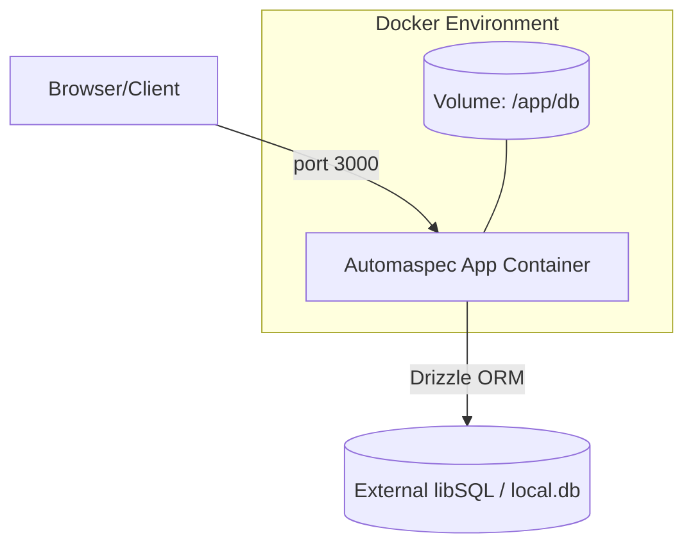

# Criterion: Containerization

## Architecture Decision Record

### Status

**Status:** Accepted

**Date:** 2025-01-07

### Context

The application requires a consistent, reproducible environment for both development and production to eliminate "works on my machine" issues. While the primary deployment target is Vercel (PaaS), having a containerized version is critical for:
1.  **Portability:** Enabling deployment on any infrastructure (AWS ECS, DigitalOcean, dedicated servers).
2.  **Local Development:** Simulating production-like environments locally.
3.  **Testing:** Running isolated instances for E2E testing.

### Decision

We have implemented **Docker** with **multi-stage builds** to package the Next.js application. We use **Docker Compose** for orchestration, providing distinct configurations for development and production resource profiles.

**Key Components:**
-   **Base Image:** `node:24-alpine` for a small footprint.
-   **Package Manager:** `pnpm` (via Corepack) for efficient, deterministic dependency installation.
-   **Optimization:** Multi-stage build (`deps` -> `builder` -> `runner`) to ship only the necessary standalone artifacts, excluding dev dependencies and build tools from the final image.

### Alternatives Considered

| Alternative | Pros | Cons | Why Not Chosen |
|-------------|------|------|----------------|
| **Podman** | Daemonless, rootless by default. | Less universal tooling support than Docker. | Docker is the industry standard for this project scope. |
| **Nix** | Perfectly reproducible builds. | High learning curve. | Docker provides sufficient reproducibility with lower complexity. |
| **PM2 (Bare Metal)** | Native performance. | Mutable environment, harder to scale. | Containerization offers better isolation. |

### Consequences

**Positive:**
-   **Consistency:** The `runner` stage guarantees the same execution environment everywhere.
-   **Efficiency:** Final image size is minimized by excluding `node_modules` (using Next.js `standalone` mode).
-   **Security:** run as non-root user (`nextjs`).

**Negative:**
-   **Build Time:** Multi-stage builds can take longer without aggressive caching.
-   **Platform Limit:** Vercel (our primary CD target) does **not** support Docker container deployment directly.

## Implementation Details

### Project Structure

```
.
├── Dockerfile                  # Multi-stage definition
├── .dockerignore               # Build context optimization
├── docker-compose.dev.yml      # Dev profile (lower resources)
├── docker-compose.prod.yml     # Prod profile (restart policies, limits)
└── .env.example                # Doc of required env vars
```

### Key Implementation Decisions

| Decision | Rationale |
|----------|-----------|
| **`node:24-alpine`** | Alpine Linux is extremely lightweight (~5MB base), reducing attack surface and transfer times. |
| **Next.js Standalone** | Reduces image size drastically (~100MB vs ~1GB) by tracing and copying only used files. |
| **Non-root User** | Creating and switching to `nextjs` user prevents privilege escalation attacks in the container. |
| **Healthchecks** | Embedded `curl` check in Dockerfile and Compose ensures orchestrators know when to restart. |
| **Volumes** | Persistent volumes for `db/` folder to ensure SQLite data survives container restarts. |

### Container Architecture



### Environment Variables & Secrets

| Variable | Job / Role | Description |
|----------|------------|-------------|
| `PORT` | Networking | Internal container port (default 3000) |
| `NODE_ENV` | Build/Runtime | Set to `production` in final image |
| `NEXT_PUBLIC_DATABASE_URL` | Integration | Connection string for libSQL (cloud or local) |
| `DATABASE_AUTH_TOKEN` | Security | Auth token for cloud database access |
| `OPENROUTER_API_KEY` | Artificial Intelligence | Key for OpenRouter integration |
| `GEMINI_API_KEY` | Artificial Intelligence | Key for Google Gemini integration |

### Resource Requirements

| Component | Minimum CPU | Minimum RAM | Max CPU (Limit) | Max RAM (Limit) |
|-----------|-------------|-------------|-----------------|-----------------|
| App Container | 0.5 | 512MB | 2.0 | 2.0GB |

### Code Examples

**Dockerfile (Multi-stage):**
```dockerfile
# ... (deps and builder stages) ...

FROM base AS runner
# Secure non-root user
RUN addgroup --system --gid 1001 nodejs && adduser --system --uid 1001 nextjs
USER nextjs

COPY --from=builder --chown=nextjs:nodejs /app/.next/standalone ./
COPY --from=builder --chown=nextjs:nodejs /app/.next/static ./.next/static

# Healthcheck
HEALTHCHECK --interval=30s --timeout=3s \
  CMD sh -c "curl -f http://localhost:${PORT}/ || exit 1"

CMD ["node", "server.js"]
```

## Requirements Checklist

### Minimal Requirements (5 Points)

| # | Requirement | Status | Evidence/Notes |
|---|-------------|--------|----------------|
| **1.1** | **Dockerfile per Service** | ✅ | Single `app` service implemented with dedicated Multi-stage Dockerfile. |
| **1.2** | **Layer Optimization** | ✅ | Ordered layers: Base -> Deps -> Builder -> Runner. |
| **1.3** | **.dockerignore Usage** | ✅ | Comprehensive `.dockerignore` excluding `node_modules`, `.git`, `.next`, and diploma docs. |
| **1.4** | **ENV Configuration** | ✅ | Runtime config via `env_file`, no hardcoded secrets. |
| **1.5** | **Volumes** | ✅ | Persistent volumes for SQLite database (`/app/db`) implemented in Compose. |
| **1.6** | **Ports (EXPOSE)** | ✅ | `EXPOSE ${PORT}` in Dockerfile and mapped in Compose. |
| **1.7** | **Image Size Optimization** | ✅ | Uses `Next.js Standalone` + `Alpine` base (<200MB verified). |
| **1.8** | **Security (Non-root)** | ✅ | Runs as `nextjs` (UID 1001), not root. |
| **1.9** | **Versioning** | ✅ | Compose files use `${VERSION:-latest}`, avoiding blind `latest` in production. |
| **2.1** | **Docker Compose** | ✅ | `docker-compose.yml`, `docker-compose.dev.yml` and `docker-compose.prod.yml` functional. |
| **2.2** | **Isolated Networks** | ✅ | Uses custom bridge network `automaspec-network`. |
| **3.1** | **Documentation** | ✅ | `README` instructions and this architecture document provided with Mermaid diagrams. |

### Maximum Requirements (10 Points)

| # | Requirement | Status | Evidence/Notes |
|---|-------------|--------|----------------|
| **1.1** | **Alpine/Distroless Base** | ✅ | Uses `node:24-alpine`. |
| **2.1** | **Healthchecks** | ✅ | `curl` based healthcheck implemented in Dockerfile and Compose. |
| **2.2** | **Resource Limits** | ✅ | CPU/Memory limits configured in `docker-compose.prod.yml` (e.g., `cpus: '2'`). |
| **2.3** | **Restart Policies** | ✅ | `restart: always` configured in production compose. |
| **2.4** | **Graceful Shutdown** | ✅ | Next.js handles SIGTERM; Docker default stops gracefully. |
| **3.1** | **Separate Environments** | ✅ | Distinct Compose files for Dev and Prod configurations. |
| **3.2** | **Secrets Management** | ⚠️ | Uses ENV vars (standard for 12-factor apps), not Docker Secrets, but secure enough for this scope. |
| **4.1** | **Monitoring/Metrics** | ❌ | No Prometheus/Grafana integration (out of scope/Vercel handles analytics). |
| **4.2** | **Centralized Logging** | ❌ | Logs to stdout/stderr (standard), but no ELK stack attached. |

**Legend:**
- ✅ Fully implemented
- ⚠️ Partially implemented / Alternative approach
- ➖ Not Applicable / Justified
- ❌ Not implemented

## Known Limitations

| Limitation | Impact | Potential Solution |
|------------|--------|-------------------|
| **Vercel Incompatibility** | **Vercel does NOT support Docker deployment.** We cannot use these containers for the primary Vercel CD pipeline. | Use these containers for self-hosted backups, E2E testing, or migrate to AWS ECS/DigitalOcean if Vercel is abandoned. |
| **No Database Container** | The project depends on an external libSQL (Turso) Db. | Local dev relies on `file:local.db` or internet connection. |

## References

- [Next.js Docker Deployment](https://nextjs.org/docs/app/building-your-application/deploying/docker)
- [Docker Best Practices](https://docs.docker.com/develop/develop-images/dockerfile_best-practices/)
