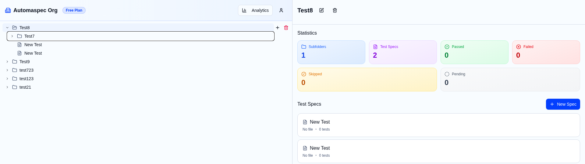
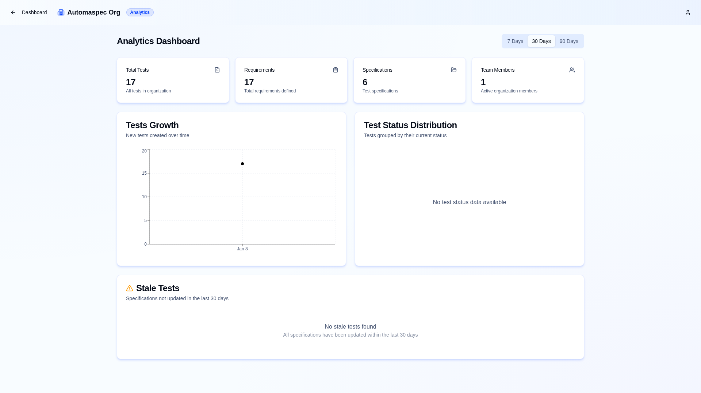
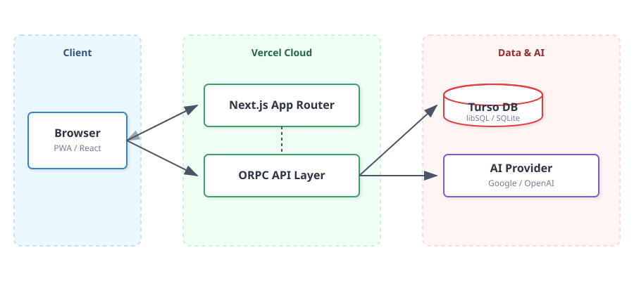
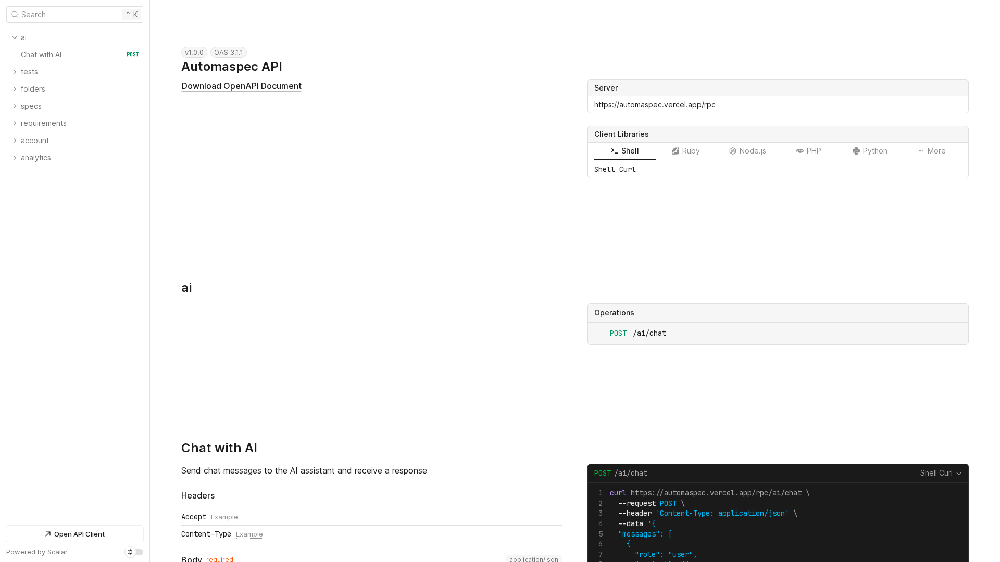

<!-- _class: lead -->

# **AutomaSpec**
## Intelligent Test Management System

<br>

**Student:** Aliaksandr Samatyia
**Group:** Js
**Supervisor:** Volha Kuznetsova
**Date:** 2026

---

# The Problem: Testing Fragmentation

**Who suffers?**
QA Engineers, Developers, and Product Managers in fast-paced teams.

**The Reality:**
- ❌ **Disconnected Workflows:** Requirements live in docs, tests live in code. Links are manual and fragile.
- ❌ **Visibility Black Holes:** Stakeholders cannot verify if a specific requirement is actually covered by a passing test.
- ❌ **Stale Documentation:** Test cases often lag behind code changes, leading to false confidence.
- ❌ **Manual & Slow:** meaningful reporting requires manual spreadsheet updates.

> *"We don't know if we broke the feature until users tell us."*

---

# The Solution: Unified Test Lifecycle

**How AutomaSpec solves it:**
AutomaSpec acts as the **central nervous system** for quality assurance, syncing code, tests, and requirements.

**Key Capabilities:**
- 🔗 **Deep Integration:** Automatically syncs Playwright & Vitest execution results to requirements.
- 📋 **Live Traceability:** Requirement $\leftrightarrow$ Test Spec $\leftrightarrow$ Execution Result. All linked.
- 🤖 **AI Assistant:** Chat with your test suite to generate cases or explain failures.

**Why it's different:**
Unlike erratic spreadsheets or siloed Jira plugins, AutomaSpec represents the **state of truth directly from CI/CD**.

---

# Demo: Core Workflow

1.  **Define Requirements:**
    Users create requirements linked to specs.
    
2.  **Sync Execution:**
    CI pipeline pushes results; coverage updates instantly.

3.  **Trace & Audit:**
    Drill down from a business goal to the specific test.

<br>



---

# Demo: Analytics Dashboard

**Real-Time Insights:**
Comprehensive metrics and visualizations for test coverage and execution trends.

- **Coverage Metrics:** Track requirement coverage over time.
- **Execution Trends:** Visualize test pass/fail rates.
- **Period Selection:** Analyze performance across different timeframes.



---

# Demo: Main Dashboard

**Centralized Test Management:**
Organized view of projects, folders, and test specifications.

- **Hierarchical Structure:** Navigate through organizations and projects.
- **Quick Access:** Direct links to requirements and test specs.
- **Status Overview:** Visual indicators for test execution status.


---

# High-Level Architecture

**Key Components:**

- **Frontend:** Next.js 16 (React 19), Tailwind CSS, Framer Motion.
- **Backend:** Serverless Functions via Vercel, ORPC for type-safe contracts.
- **Database:** Distributed SQLite (Turso) managed via Drizzle ORM.
- **AI Integration:** Vercel AI SDK into Google/OpenAI.



---

# Technology Stack

| Category | Technology | Purpose |
| :--- | :--- | :--- |
| **Framework** | **Next.js 16** | Full-stack React framework with App Router |
| **Language** | **TypeScript** | Strict type safety across full stack |
| **Database** | **Turso (LibSQL)** | Edge-compatible distributed SQLite |
| **ORM** | **Drizzle ORM** | Type-safe SQL builder and schema management |
| **API** | **ORPC** | End-to-end type-safe API contracts |
| **Testing** | **Playwright + Vitest** | E2E and Unit testing frameworks |
| **AI** | **Vercel AI SDK** | Integration with LLM providers (Google/OpenAI) |

---

<!-- _header: Criterion 1: Front-End Configuration -->

# Front-End Architecture

**WHY:**
Needed a scalable, SEO-friendly SPA with robust server integration for a complex dashboard.

**WHAT:**
- **App Router:** Hierarchical routing for Organizations/Projects.
- **Server State:** TanStack Query for caching & optimistic updates.
- **Type Safety:** End-to-end typed API calls via oRPC.
- **Components:** Modular UI using Radix Primitives.

**TECH:** Next.js 16, React 19, TanStack Query, Radix UI

```typescript
// Type-safe reactive data fetching with TanStack Query
const [period] = useState<AnalyticsPeriod>('30d')
const { data } = useQuery(orpc.analytics.getMetrics.queryOptions({ 
    input: { period } 
}))
```

---

<!-- _header: Criterion 2: Adaptive UI -->

# Adaptive User Interface

**WHY:** 
To provide a seamless experience for QA engineers across Desktop (4K), Tablet, and Mobile devices.

**WHAT:**
- **Mobile-First:** Styles defined for small screens, scaling up via breakpoints (`sm`, `md`, `lg`).
- **Responsive Navigation:** Sidebar on desktop -> Drawer on mobile.
- **Theme Support:** System-aware Dark/Light mode integration.
- **Accessibility:** WCAG 2.1 AA compliance via Radix UI.

**TECH:** Tailwind CSS v4, Lucide Icons, next-themes

<br>

> *Verified support for 16:9, 21:9, and mobile portrait aspect ratios.*

---

<!-- _header: Criterion 3: API Documentation -->

# API Documentation

**WHY:** 
Ensure external integrations and developers have an accurate source of truth.

**WHAT:**
- **Auto-Generated:** Docs derived from Zod schemas.
- **Interactive:** Scalar UI for in-browser testing.
- **OpenAPI:** Exports valid 3.0 spec.
- **Zero Drift:** Docs update with code.

**TECH:** oRPC, Scalar UI, Zod, OpenAPI



---

<!-- _header: Criterion 4: CI/CD Pipeline -->

# CI/CD Pipeline

**WHY:**
To automate quality control and ensure safe, frequent deployments to production.

**WHAT:**
1.  **Quality Gate:** Lint (`oxlint`), Format, Typecheck before merge.
2.  **Security:** Automated `pnpm audit` for dependencies.
3.  **Test Automation:** Unit (Vitest) + E2E (Playwright) execution.
4.  **Delivery:** Auto-deploy to Vercel (Preview/Prod).

**TECH:** GitHub Actions, Vercel CLI, Docker, Lefthook


---

<!-- _header: Criterion 5: Containerization -->

# Containerization

**WHY:**
To guarantee environment consistency ("works on my machine") and enable portability.

**WHAT:**
- **Multi-Stage Build:** `deps` → `builder` → `runner` (Optimized layers).
- **Standalone Mode:** Trims `node_modules` for ~100MB final image.
- **Security:** Runs as non-root user (`nextjs`).
- **Orchestration:** Docker Compose profiles for Dev vs. Prod.

**TECH:** Docker, Docker Compose, node-alpine

```dockerfile
# Final Stage
FROM base AS runner
USER nextjs
COPY --from=builder /app/.next/standalone ./
CMD ["node", "server.js"]
```

---

# Challenges & Solutions

| Challenge | Solution | 
| :--- | :--- |
| **Vercel vs Docker** | *Problem:* Vercel doesn't run Docker. <br> *Fix:* Used Hybrid strategy—Docker for local dev/testing reliability, Vercel for scalable Serverless production. |
| **Type Synchronization** | *Problem:* Keeping API and Frontend types in sync. <br> *Fix:* Implemented **oRPC** to infer frontend types directly from backend Zod schemas. |
| **Complex State** | *Problem:* Managing real-time spec updates. <br> *Fix:* Utilized **TanStack Query** for efficient server-state caching and optimistic UI updates. |

---

# Results

**✅ Project Checklist**
- [x] **Core MVP:** Requirement management & Test syncing.
- [x] **Architecture:** Scalable Next.js 16 + Serverless setup.
- [x] **Quality:** CI/CD pipeline with 100% E2E critical flow coverage.
- [x] **Documentation:** Auto-generated API Reference.


---

<!-- _class: lead -->

# Q&A

**Production:** [automaspec.vercel.app](https://automaspec.vercel.app)
**Repository:** [github.com/qweered/automaspec](https://github.com/qweered/automaspec)
**Documentation:** `/rpc/docs` (Scalar)

<br>

## Thank You!

**Student:** Aliaksandr Samatyia
**Contact:** aliaksandr.samatyia@stud.ehu.lt

