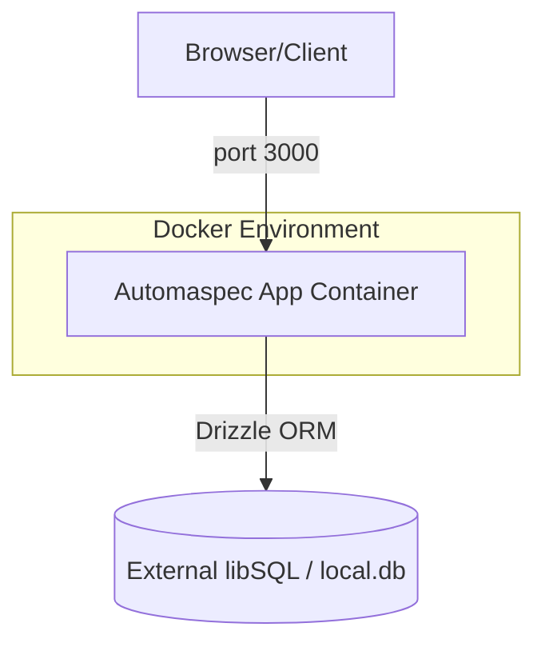

# Automaspec

## Development

### Git Hooks

This project uses [Lefthook](https://lefthook.dev/) for managing git hooks to ensure code quality and consistency.

#### Pre-commit Hooks

The following checks run on staged files before each commit:

- **Database Schema Check**: Validates Drizzle schema changes (`drizzle-kit check`) on `db/schema/*.ts`
- **Prettier**: Code formatting (`prettier --write`)
- **Oxlint**: Code linting with auto-fix

#### Pre-push Hooks

Pre-push hooks are currently disabled (commented out in `lefthook.yml`). Uncomment to enable if desired.

#### Bypassing Hooks

If you need to bypass hooks (use sparingly):

```bash
# Skip pre-commit hooks
git commit --no-verify

# Skip pre-push hooks
git push --no-verify
```

#### Manual Hook Execution

You can manually run hooks for testing:

```bash
# Run pre-commit checks
pnpx lefthook run pre-commit

# Run pre-push checks
pnpx lefthook run pre-push
```

## Overview

Automaspec helps organize test specifications, requirements, and individual tests in a foldered hierarchy with per‑spec status breakdowns. It includes authentication, organizations, and a dashboard UI.

## Tech Stack

- Next.js 16 (Turbopack) + React 19
- Drizzle ORM with libsql/Turso
- Better Auth (with organizations plugin)
- oRPC + TanStack Query
- Tailwind CSS v4
- Vitest + React Testing Library
- Lefthook, Prettier, Oxlint

## Prerequisites

- Node.js (active LTS recommended)
- pnpm
- Turso CLI (for `turso dev`) or another libsql-compatible server

## Setup

1. Install dependencies

    ```bash
    pnpm install
    ```

2. Environment variables

    Copy `.env.example` to `.env.local` for local dev and to `.env` for Docker:

    ```env
    NEXT_PUBLIC_DATABASE_URL=https://your-cloud-libsql-endpoint
    DATABASE_AUTH_TOKEN=your-cloud-libsql-token
    # Optional: VERCEL_URL=your-vercel-deployment-url
    # Optional: OPENROUTER_API_KEY=...
    # Optional: GEMINI_API_KEY=...
    ```

3. Database (local libsql)

Start a local libsql dev server backed by `db/local.db`:

```bash
pnpm db:local
```

In another terminal, run migrations:

```bash
pnpm dbm
```

Optional: open Drizzle Studio

```bash
pnpm dbs
```

Optional: seed sample data into `db/local.db`:

```bash
sqlite3 db/local.db < sample_data.sql
```

## Run

```bash
pnpm dev     # start Next.js (Turbopack)
pnpm build   # build
pnpm start   # run production build
```

## Testing

```bash
pnpm test             # run unit/component tests
pnpm test --watch     # watch mode
pnpm test tests/components/test-details-panel.test.tsx
```

Notes:

- Integration tests are skipped by default; to enable, set `NEXT_PUBLIC_DATABASE_URL` to a reachable libsql endpoint.

## Containerization

The application is fully containerized for reproducible deployments and local development.

### Prerequisites

- [Docker](https://docs.docker.com/get-docker/)
- [Docker Compose](https://docs.docker.com/compose/install/)

### Quick Start

1.  **Configure Environment**:
    Copy `.env.example` to `.env` and fill in the required secrets.
    ```bash
    cp .env.example .env
    ```

2.  **Start Application**:
    ```bash
    # For standard development
    docker compose up --build

    # For production-optimized profile
    docker compose -f docker-compose.prod.yml up --build -d
    ```

3.  **Stop Application**:
    ```bash
    docker compose down
    ```

### Container Architecture

The system uses a multi-stage Alpine-based container to minimize footprint and maximize security.



### Resource Management

| Environment | CPU Limit | Memory Limit | Restart Policy |
|-------------|-----------|--------------|----------------|
| **Development** | 1.0 | 1.5 GB | `unless-stopped` |
| **Production** | 2.0 | 2.0 GB | `always` |

### Environment Variables

| Variable | Description | Required |
|----------|-------------|----------|
| `NEXT_PUBLIC_DATABASE_URL` | Primary database connection string (cloud or local) | Yes |
| `DATABASE_AUTH_TOKEN` | Auth token for cloud libSQL | If cloud |
| `OPENROUTER_API_KEY` | API key for AI features | Optional |
| `GEMINI_API_KEY` | API key for AI features | Optional |
| `PORT` | Container internal/external port (default: 3000) | No |

## Scripts

Common scripts (see `package.json`):

- `dev`, `build`, `start`
- `test`
- `db:local`, `dbg` (generate), `dbm` (migrate), `dbs` (studio), `dbup` (generate+migrate)
- `lint`, `format`, `typecheck` (lefthook-driven jobs)

## Releases

- Changelog: `CHANGELOG.md`
- Versioning policy: `VERSIONING.md`
- Release process + release notes template: `RELEASING.md`

## Notes

- The app reads database credentials from `NEXT_PUBLIC_DATABASE_URL` and `DATABASE_AUTH_TOKEN` (see `db/index.ts` and `drizzle.config.ts`).
- Better Auth trusted origins use `VERCEL_URL` in production if set.
