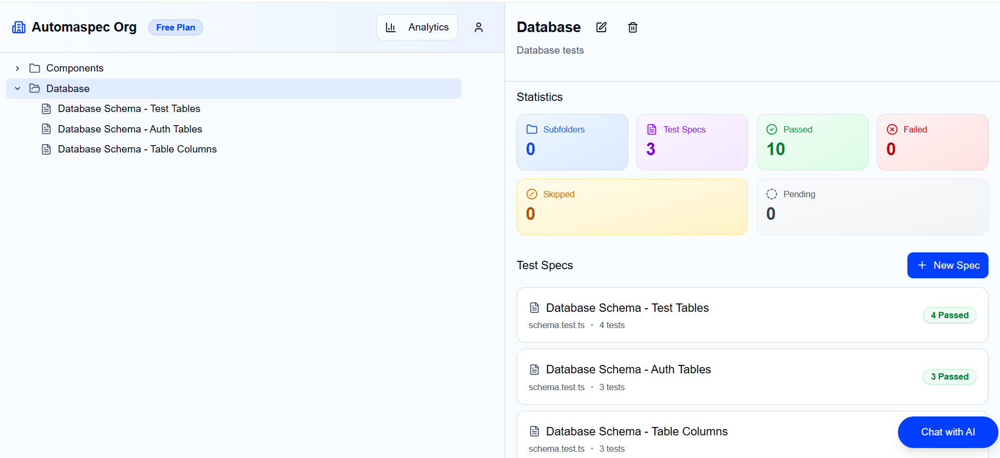
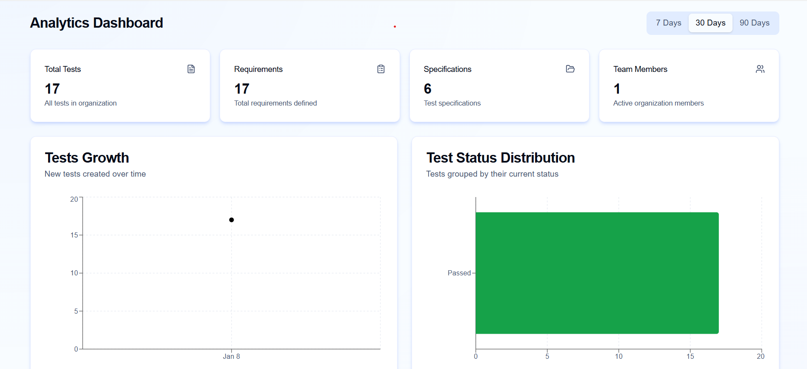

# Feature Walkthrough

## Feature 1: Hierarchical Test Organization

### Overview

Organize your test specifications in a flexible folder hierarchy. Create unlimited nested folders to mirror your project structure, feature areas, or team organization.

### How to Use

**Step 1:** Click **"+ New Folder"** in the left sidebar
- Enter a descriptive name (e.g., "Authentication", "User Management")
- Optionally select a parent folder for nesting

**Step 2:** Create nested folders by right-clicking an existing folder
- Select "New Subfolder"
- Organize by feature, sprint, or component

**Step 3:** Drag and drop folders to reorder
- Hold and drag to change order
- Drop on another folder to nest

**Expected Result:** A structured tree view showing your organized test hierarchy

### Tips

- Use consistent naming conventions (e.g., "Feature - Module - Component")
- Create a "Drafts" folder for work-in-progress specs
- Archive old specs in an "Archive" folder instead of deleting

---

## Feature 2: Test Specification Management

### Overview

Create detailed test specifications that contain requirements and individual tests. Each spec tracks aggregated status across all its tests.

### How to Use

**Step 1:** Select a folder and click **"+ New Spec"**
- Enter a descriptive name
- Add an optional description explaining the test scope

**Step 2:** View spec details in the right panel
- See status breakdown (passed, failed, pending, skipped)
- View total test count
- Access linked file reference

**Step 3:** Edit spec properties inline
- Click on name or description to edit
- Changes auto-save

**Expected Result:** A complete test spec with status visualization

---

## Feature 3: Requirements Definition

### Overview

Break down each spec into granular, testable requirements. Requirements serve as the foundation for AI-generated tests.

### How to Use

**Step 1:** Open a test spec and click **"+ Add Requirement"**
- Enter a clear, specific requirement title
- Example: "User can login with valid email and password"

**Step 2:** Add detailed description
- Describe expected behavior
- Include acceptance criteria
- Specify edge cases to test

**Step 3:** Reorder requirements via drag-and-drop
- Prioritize critical requirements at the top

**Expected Result:** A comprehensive list of testable requirements

### Tips

- Write requirements in user story format: "As a [user], I want [action], so that [benefit]"
- Keep requirements atomic (one testable thing per requirement)
- Include both positive and negative test scenarios

---

## Feature 4: AI-Powered Test Generation

### Overview

Generate Vitest test code from natural language requirements using AI. The system understands your context and produces ready-to-use test code.

### How to Use

**Step 1:** Select a requirement and click **"Generate with AI"**
- The AI panel opens on the right side
- Your requirement context is automatically included

**Step 2:** Review the streaming response
- Watch as test code generates in real-time
- Code appears with syntax highlighting

**Step 3:** Accept, edit, or regenerate
- Click **"Accept"** to save the generated code
- Edit inline if adjustments are needed
- Click **"Regenerate"** for a different approach

**Expected Result:** Valid Vitest test code attached to your requirement

### Tips

- Provide detailed requirement descriptions for better results
- Review generated assertions for correctness
- Combine AI generation with manual refinement for best quality

---

## Feature 5: Test Status Tracking

### Overview

Track test execution status across your entire test suite. Status aggregates from individual tests up through requirements and specs.

### How to Use

**Step 1:** View status indicators on specs and folders
- Green: All tests passing
- Red: One or more tests failing
- Yellow: Tests pending or skipped

**Step 2:** Drill down to identify issues
- Click on a spec to see requirement-level breakdown
- Click on a requirement to see individual test results

**Step 3:** Update status manually or via CI/CD sync
- Individual tests can be marked manually
- Connect GitHub Actions for automatic updates

**Expected Result:** Real-time visibility into test health

---

## Feature 6: Analytics Dashboard

### Overview

Visualize your test coverage and health metrics with interactive charts and statistics.

### How to Use

**Step 1:** Navigate to **Analytics** in the top menu

**Step 2:** View key metrics:
- Total specs, requirements, and tests
- Pass/fail rates
- Coverage trends over time

**Step 3:** Filter by time period
- Select 7 days, 30 days, or custom range
- Compare across periods

**Expected Result:** Data-driven insights into your testing efforts

---

## Feature 7: Team Collaboration

### Overview

Invite team members to your organization with role-based access control.

### How to Use

**Step 1:** Go to **Profile** → **Organization Settings**

**Step 2:** Click **"Invite Members"**
- Enter email addresses
- Select role (Admin or Member)

**Step 3:** Manage existing members
- View all members and their roles
- Change roles or remove members as needed

**Expected Result:** Collaborative workspace with proper access controls

---

## Feature 8: Dark/Light Theme

### Overview

Switch between dark and light themes based on preference or system settings.

### How to Use

**Step 1:** Click the theme toggle in the header (sun/moon icon)

**Step 2:** Choose your preference:
- Light mode
- Dark mode
- System (follows OS preference)

**Expected Result:** Consistent theme across all pages
