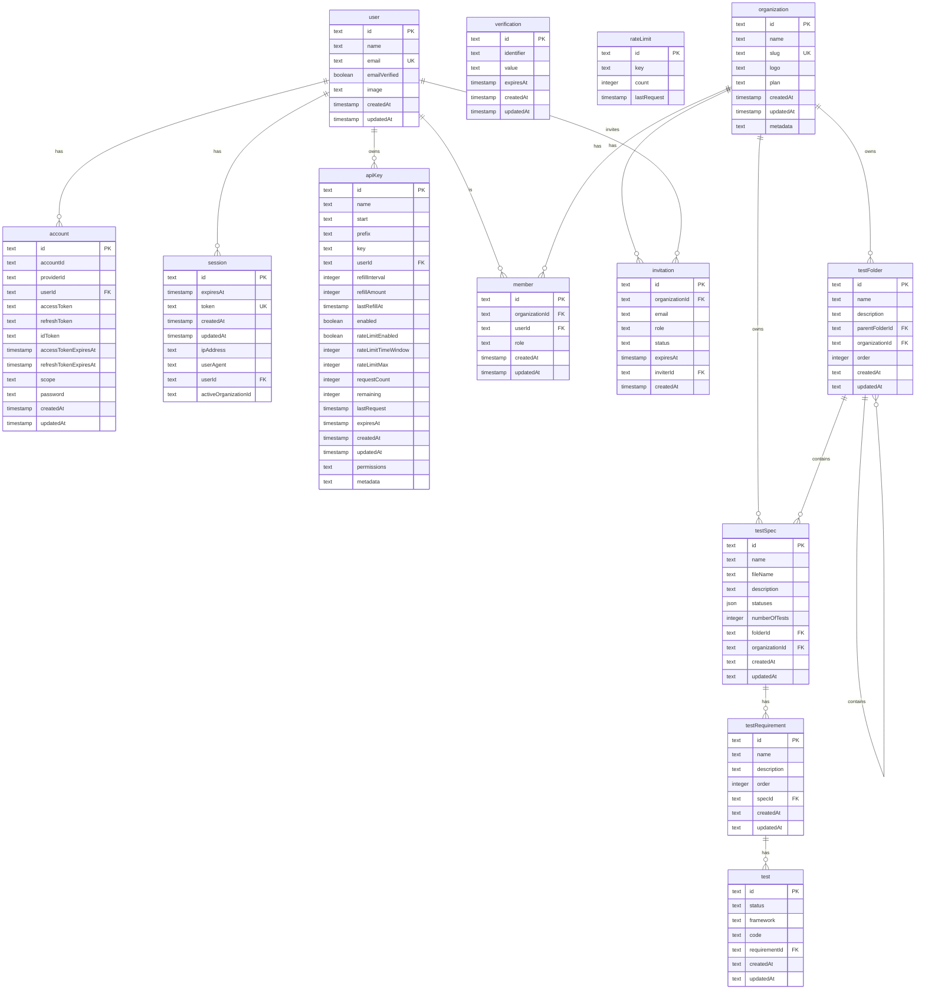

# Database Schema

## Overview

The application uses **SQLite** (via LibSQL/Turso) as its relational database, with **Drizzle ORM** for type-safe schema definition and query building. The schema is modularized into two main domains: **Authentication/Organization** and **Testing Core**.

| Attribute | Value |
|-----------|-------|
| **Database** | SQLite (LibSQL/Turso) |
| **ORM** | Drizzle ORM |
| **Migrations** | Drizzle Kit |

## Entity Relationship Diagram

> **Interactive Version**: Open `db-schema.html` in a browser for an interactive, printable version.



## Tables Reference

### Authentication & Organization (`db/schema/auth.ts`)

#### `user`

Core user entity.

| Column | Type | Constraints | Description |
|--------|------|-------------|-------------|
| id | text | PK | Unique identifier |
| name | text | NOT NULL | Display name |
| email | text | NOT NULL, UNIQUE | User email |
| emailVerified | boolean | NOT NULL | Email verification status |
| image | text | NULLABLE | Avatar URL |
| createdAt | timestamp | NOT NULL | Creation time |
| updatedAt | timestamp | NOT NULL | Last update time |

#### `session`

Active user sessions.

| Column | Type | Constraints | Description |
|--------|------|-------------|-------------|
| id | text | PK | Unique identifier |
| userId | text | FK → user.id | Session owner |
| token | text | NOT NULL, UNIQUE | Session token |
| expiresAt | timestamp | NOT NULL | Expiration time |
| ipAddress | text | NULLABLE | Client IP |
| userAgent | text | NULLABLE | Browser/client info |
| activeOrganizationId | text | NULLABLE | Current org context |

#### `account`

OAuth/credential accounts linked to users.

| Column | Type | Constraints | Description |
|--------|------|-------------|-------------|
| id | text | PK | Unique identifier |
| userId | text | FK → user.id | Account owner |
| providerId | text | NOT NULL | e.g., "credential", "google" |
| accountId | text | NOT NULL | Provider-specific ID |
| accessToken | text | NULLABLE | OAuth access token |
| refreshToken | text | NULLABLE | OAuth refresh token |
| password | text | NULLABLE | Hashed password (credential auth) |

#### `organization`

Multi-tenant organization unit.

| Column | Type | Constraints | Description |
|--------|------|-------------|-------------|
| id | text | PK | Unique identifier |
| name | text | NOT NULL | Organization name |
| slug | text | UNIQUE | URL-friendly identifier |
| logo | text | NULLABLE | Logo URL |
| plan | text | NOT NULL, DEFAULT 'free' | Subscription plan |
| metadata | text | NULLABLE | JSON metadata |

#### `member`

Linking table between Users and Organizations.

| Column | Type | Constraints | Description |
|--------|------|-------------|-------------|
| id | text | PK | Unique identifier |
| organizationId | text | FK → organization.id | Organization |
| userId | text | FK → user.id | User |
| role | text | NOT NULL, DEFAULT 'member' | Role: 'owner', 'admin', 'member' |

#### `invitation`

Pending organization invites.

| Column | Type | Constraints | Description |
|--------|------|-------------|-------------|
| id | text | PK | Unique identifier |
| email | text | NOT NULL | Invitee email |
| organizationId | text | FK → organization.id | Target organization |
| inviterId | text | FK → user.id | Who sent the invite |
| role | text | NULLABLE | Role to be assigned |
| status | text | NOT NULL, DEFAULT 'pending' | Status: 'pending', 'accepted' |
| expiresAt | timestamp | NOT NULL | Invitation expiration |

#### `apiKey`

API access keys for external integrations.

| Column | Type | Constraints | Description |
|--------|------|-------------|-------------|
| id | text | PK | Unique identifier |
| name | text | NULLABLE | Key name |
| key | text | NOT NULL | Hashed key value |
| userId | text | FK → user.id | Key owner |
| enabled | boolean | DEFAULT true | Is key active |
| rateLimitEnabled | boolean | DEFAULT true | Rate limiting on/off |
| rateLimitMax | integer | DEFAULT 10 | Max requests per window |
| permissions | text | NULLABLE | JSON permission scopes |

---

### Testing Core (`db/schema/tests.ts`)

#### `test_folder`

Hierarchical organization for test specs.

| Column | Type | Constraints | Description |
|--------|------|-------------|-------------|
| id | text | PK | Unique identifier |
| name | text | NOT NULL | Folder name |
| description | text | NULLABLE | Optional description |
| parentFolderId | text | NULLABLE | Parent folder for nesting |
| organizationId | text | FK → organization.id | Owner organization |
| order | integer | NOT NULL, DEFAULT 0 | Sorting order |
| createdAt | text | NOT NULL | Creation timestamp |
| updatedAt | text | NOT NULL | Last update timestamp |

#### `test_spec`

A test specification containing requirements.

| Column | Type | Constraints | Description |
|--------|------|-------------|-------------|
| id | text | PK | Unique identifier |
| name | text | NOT NULL | Spec name |
| fileName | text | NULLABLE | Source file reference |
| description | text | NULLABLE | Optional description |
| statuses | json | NOT NULL | Aggregated status counts |
| numberOfTests | integer | NOT NULL, DEFAULT 0 | Total test count |
| folderId | text | FK → test_folder.id | Parent folder |
| organizationId | text | FK → organization.id | Owner organization |

#### `test_requirement`

Specific business requirement to be tested.

| Column | Type | Constraints | Description |
|--------|------|-------------|-------------|
| id | text | PK | Unique identifier |
| name | text | NOT NULL | Requirement title |
| description | text | NULLABLE | Detailed description |
| order | integer | NOT NULL, DEFAULT 0 | Sorting order |
| specId | text | FK → test_spec.id | Parent spec |

#### `test`

Individual test implementation.

| Column | Type | Constraints | Description |
|--------|------|-------------|-------------|
| id | text | PK | Unique identifier |
| status | text | NOT NULL | Test result: passed, failed, pending, skipped |
| framework | text | NOT NULL | Framework: vitest, jest, playwright |
| code | text | NULLABLE | Generated test code |
| requirementId | text | FK → test_requirement.id | Parent requirement |

## Relationships

| Relationship | Type | Description |
|--------------|------|-------------|
| User → Session | One-to-Many | User can have multiple sessions |
| User → Member | One-to-Many | User can belong to multiple orgs |
| Organization → Member | One-to-Many | Org has multiple members |
| Organization → TestFolder | One-to-Many | Org owns folders |
| TestFolder → TestFolder | One-to-Many | Folder nesting (self-referential) |
| TestFolder → TestSpec | One-to-Many | Folder contains specs |
| TestSpec → TestRequirement | One-to-Many | Spec defines requirements |
| TestRequirement → Test | One-to-Many | Requirement has tests |

## Migrations

Migrations are managed via Drizzle Kit and stored in `db/migrations/`.

| Command | Description |
|---------|-------------|
| `pnpm dbg` | Generate migration from schema changes |
| `pnpm dbm` | Apply migrations to database |
| `pnpm dbs` | Open Drizzle Studio |
| `pnpm dbup` | Generate + apply migrations |

## Seeding

Test data can be loaded via:

```bash
sqlite3 db/local.db < sample_data.sql
```
