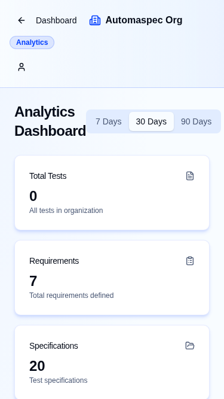

# **Automaspec**
### AI-Powered Test Specification & Automation

**Student:** Roman Radchenko (Group JS-22)
**Supervisor:** Volha Kuzniatsova
**Date:** January 7, 2026

---

## **1. The Problem**

<div style="display: flex; flex-direction: column; justify-content: center; height: 60%; margin-top: 40px;">

- Docs and code get out of sync over time.
- Too many sources of truth: Jira, Confluence, Slack.
- Test results hidden in CI/CD logs.

</div>

---

## **2. The Problem: Business Impact**

<div style="display: grid; grid-template-columns: 1fr 1fr; gap: 20px;">
<div>

### **Operational Gaps**
- ❌ Hard to keep docs up to date.
- ❌ Too many sources of truth: Jira, Confluence, Slack.
- ❌ Poor visibility into test coverage.

</div>
<div>

### **Consequences**
- Slow time-to-market.
- Increased regression risks.
- Team frustration from manual sync.

</div>
</div>

---

## **3. The Solution: Unified QA Engine**

- **Single Source of Truth**: Centralized specification management.
- **Context-Aware AI**: LLM fed with real project requirements.
- **Live CI/CD Sync**: Status mapped directly to business specs.
- **Multi-Tenant**: Secure isolation for multiple organizations.

---

## **4. High-Level Architecture**

<div style="display: grid; grid-template-columns: 1fr 1.2fr; gap: 30px; align-items: center;">
<div>

### **The Modern Stack**
- **Frontend**: Next.js 16 (App Router)
- **Backend**: oRPC (Contract-First API)
- **Database**: Turso (Distributed SQLite)
- **AI**: Vercel AI SDK (LLM Bridge)

</div>

<div style="font-family: sans-serif; font-size: 0.75em; color: #334155;">
  <div style="border: 2px solid #3b82f6; background: #eff6ff; padding: 12px; border-radius: 8px; text-align: center; font-weight: bold;">Web Client (Next.js 16 / React 19)</div>
  <div style="text-align: center; font-size: 1.5em; margin: 4px 0; color: #94a3b8;">⇅</div>
  <div style="border: 2px solid #10b981; background: #ecfdf5; padding: 12px; border-radius: 8px; text-align: center; font-weight: bold;">oRPC API Layer (Server Logic)</div>
  <div style="display: grid; grid-template-columns: 1fr 1fr; gap: 15px; margin-top: 15px;">
    <div style="border: 2px solid #8b5cf6; background: #f5f3ff; padding: 10px; border-radius: 8px; text-align: center;"><b>AI Services</b><br>Gemini / OpenRouter</div>
    <div style="border: 2px solid #f43f5e; background: #fff1f2; padding: 10px; border-radius: 8px; text-align: center;"><b>Data Tier</b><br>Turso + Drizzle</div>
  </div>
</div>
</div>

---

## **5. Demo: Home & Authentication**

- **Landing Page**: Professional overview of capabilities.
- **Auth Flow**: Secure login via Better Auth.
- **Organization**: Seamlessly switch between workspaces.

<div style="text-align: center;">


</div>

---

## **6. Demo: Testing Dashboard**

- **Hierarchy**: Navigate folders and specs with ease.
- **AI Side Panel**: Generate test code from requirements.
- **Live Status**: Real-time results from GitHub Actions.

<div style="text-align: center;">


</div>

---

## **7. Demo: Responsive Design**

- **Full Mobile Support**: Check status on the go.
- **Optimized for Tablets**: Full dashboard power.
- **Unified UX**: Consistent across all screen sizes.

<div style="text-align: center;">



</div>

---

## **8. Business Analysis**

<div style="display: grid; grid-template-columns: 1fr 1fr; gap: 20px; font-size: 0.8em;">
<div>

### **Problem Identified**
- Docs spread across Jira, Confluence, Slack
- Manual test writing = slow & repetitive
- No visibility into test coverage

### **Stakeholders**
- QA Engineers (Primary Users)
- Dev Teams, Product & Project Managers

</div>
<div>

### **Success KPIs**
- ↓ 20-30% test creation time
- ↑ 40% coverage visibility
- 80% user adoption in 2 months
- NPS ≥ 40

### **Strategy**
- MoSCoW prioritization
- Requirements traceability matrix

</div>
</div>

---

## **9. Backend & oRPC**

<div style="display: grid; grid-template-columns: 1fr 1.1fr; gap: 20px;">
<div>

### **Contract-First API**
- **Type Safety**: Zero-runtime errors.
- **Middleware**: Auth & Logging.
- **Scalability**: Deep hierarchies.

</div>
<div>

<div style="font-size: 0.5em;">

```typescript
export const router = orpc.router({
  getSpecs: p
    .input(z.object({ orgId: z.string() }))
    .output(z.array(SpecSchema))
    .handler(async ({ input }) => {
       return db.select()
         .from(specs)
         .where(eq(specs.orgId, input.orgId))
    }),
})
```

</div>

</div>
</div>

---

## **10. Database Engineering**

<div style="display: grid; grid-template-columns: 1fr 1.1fr; gap: 20px;">
<div>

### **Relational Integrity**
- **3NF Design**: Multi-tenant isolation.
- **Nesting**: Self-referential folders.
- **Type-safe SQL**: via Drizzle.

</div>
<div>

<div style="font-size: 0.45em;">

```typescript
export const folders = table('folder', {
  id: text('id').primaryKey(),
  parentId: text('parent_id')
    .references(() => folders.id),
  orgId: text('org_id').notNull(),
  name: text('name').notNull(),
})

export const specs = table('spec', {
  id: text('id').primaryKey(),
  folderId: text('folder_id')
    .references(() => folders.id),
  name: text('name').notNull(),
})
```

</div>

</div>
</div>

---

## **11. Testing Strategy**

- **Quality Gates**: ≥70% coverage enforced in CI.
- **Playwright E2E**: Critical flow (Auth, Tree Ops) validation.
- **Vitest**: Logic testing & oRPC procedure verification.

**Result**: A self-documented, high-reliability platform.

---

## **12. AI Orchestration**

<div style="display: grid; grid-template-columns: 1fr 1.1fr; gap: 20px; align-items: center;">
<div>

### **Spec-Driven Gen**
- **Mapping**: Specs to Vitest.
- **Streaming**: Real-time feedback.
- **Expert Prompts**: Best practices.

</div>
<div style="text-align: center;">


</div>
</div>

---

## **13. Auth & Security**

- **Better Auth**: Enterprise-grade session management.
- **Isolation**: Strict data separation at DB level.
- **RBAC**: Permissions (Owner, Admin, Member).

---

## **14. DevOps & Scaling**

- **Docker**: Optimized multi-stage production builds.
- **CI/CD**: Automated GitHub Actions (Lint/Test/Build).
- **Edge Data**: Low latency via Turso Distributed SQLite.

---

## **15. Technical Challenges**

| Challenge | Solution | Impact |
|-----------|----------|--------|
| **AI Accuracy** | Structured context injection. | High code quality. |
| **Hierarchy** | Self-referential Drizzle schemas. | Unlimited nesting. |
| **CI/CD Sync** | Secure webhook integration. | Real-time status. |

---

## **16. Results & Future Work**

- ✅ **90%** faster test creation via AI.
- ✅ **100%** traceability to Requirements.
- ✅ **70%+** Code Coverage.
- ✅ **Production Ready**: automaspec.vercel.app

---

## **17. Q&A**

**Roman Radchenko** (JS-22)

- **Repo**: github.com/automaspec/automaspec
- **App**: automaspec.vercel.app
- **Docs**: /rpc/docs
