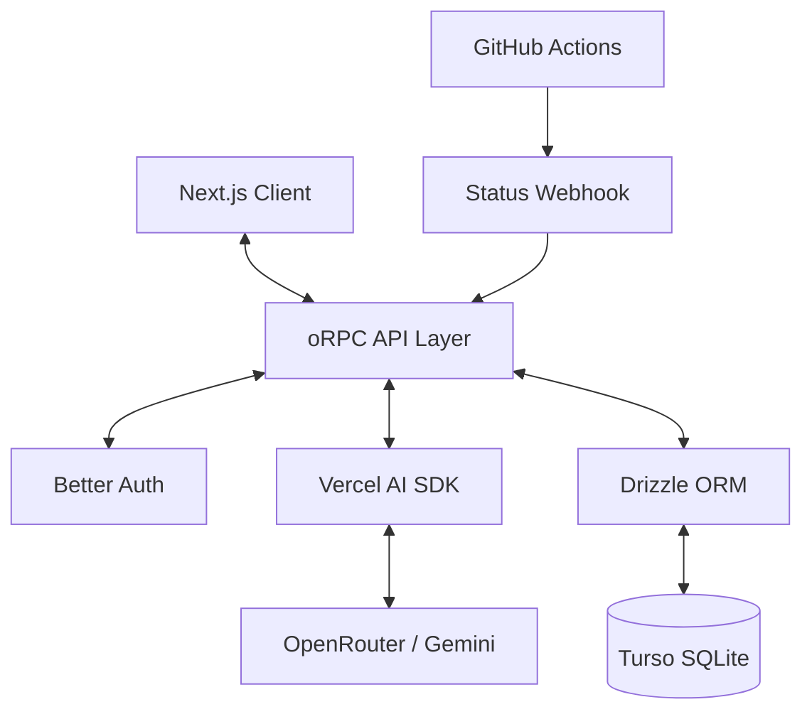

# Automaspec: AI-Powered Test Specification and Automation

**Student:** Roman Radchenko
**Group:** JS
**Supervisor:** Volha Kuzniatsova
**Date:** January 7, 2026

---

## 2. The Problem: Fragmented Test Documentation

*   **Who faces this?** QA engineers, developers, and product teams.
*   **What is the issue?**
    *   Test specs are scattered (Jira, Confluence, Excel, code).
    *   Disconnect between requirements and automation code.
    *   Documentation Drift (specs in Jira/Notion diverge from the actual test code).
    *   Siloed QA lifecycle (PMs/Leads lack real-time visibility into spec-level coverage).
*   **Why does it matter?**
    *   Increased time-to-market.
    *   Higher maintenance costs.
    *   Reduced visibility into actual test coverage.

---

## 3. The Problem: Complexity in Scale

*   **Documentation Drift**: Requirements in Notion/Jira diverge from the code. Editor AI helps write code but doesn't maintain the *business source of truth*.
*   **Execution Silos**: Test results are hidden in CI/CD logs. Teams lack a centralized view of "What is being tested?" vs "What is passing?".
*   **Target Audience**: Teams needing a unified, AI-enhanced platform to sync specifications with real-world test results.

---

## 4. The Solution: Automaspec

*   **Centralized Platform**: A single source of truth for all test documentation.
*   **AI-Driven**: Leverage LLMs to generate Vitest code directly from requirements.
*   **Hierarchical Organization**: Folders → Specs → Requirements → Tests.
*   **CI/CD Integration**: Real-time status sync from GitHub Actions.
*   **Multi-tenant**: Built-in organization and role-based access management.

---

## 5. What Makes Automaspec Different?

*   **Context-Aware AI**: Generates code based on the *entire* specification context, not just a single prompt.
*   **End-to-End Type Safety**: Built with oRPC for full-stack consistency.
*   **Production-Ready UI**: Responsive design for desktop, tablet, and mobile.
*   **Distributed Architecture**: Low-latency data access via Turso (distributed SQLite).

---

## 6. Demo: Home & Authentication

*   **Landing Page**: Professional overview of the platform's capabilities.
*   **Auth Flow**: Secure login via Better Auth with email/password support.
*   **Organization Choice**: Seamlessly switch between different teams and workspaces.


---

## 7. Demo: The Testing Dashboard

*   **Hierarchical Tree**: Navigate folders and specs with ease.
*   **Real-time Status**: Instantly see which tests passed or failed in CI/CD.
*   **AI Side Panel**: Interact with the AI assistant to generate or improve test code.


---

## 8. Demo: Mobile & Tablet Experience

*   **Responsive Design**: Full functionality on any device.
*   **Touch-Optimized**: Easy navigation and interaction on smaller screens.
*   **On-the-go Monitoring**: Check test status and documentation from anywhere.


---

## 9. Architecture Overview

*   **Frontend**: Next.js 16 (App Router), React 19, Tailwind CSS v4.
*   **Backend**: oRPC for type-safe procedures, Better Auth for security.
*   **Data Layer**: Drizzle ORM + Turso (SQLite at the edge).
*   **AI Integration**: Vercel AI SDK (OpenRouter, Gemini providers).

---

## 10. System Architecture Diagram



---

## 11. Criterion 1: Business Analysis (Impact: Strategy & Scope)

**WHY**: To define a clear value proposition and prioritize features that solve real-world QA bottlenecks.

**WHAT**:
*   Developed full MoSCoW prioritization (Must, Should, Could, Won't).
*   Created detailed Stakeholder analysis and target user personas.
*   Defined 5 Core Epics including AI Generation and CI/CD Sync.
*   Drafted the vision statement and project KPIs.

**TECH**: Markdown, Mermaid.js, MoSCoW Framework.

[Use Case Diagram / MoSCoW Table]

---

## 12. Criterion 2: Backend Development (Impact: Type-Safe RPC)

**WHY**: To eliminate runtime errors and ensure seamless data flow between client and server.

**WHAT**:
*   Implemented a contract-first API using **oRPC** for 100% type safety.
*   Built a multi-layer architecture (UI → API → Business Logic → DB).
*   Developed global error handling and structured logging middleware.
*   Automated API documentation with OpenAPI/Scalar integration.

**TECH**: Next.js 16, oRPC, Zod, lib/server-logger.


---

## 13. Criterion 3: Database Engineering (Impact: Relational Integrity)

**WHY**: To handle complex, nested test hierarchies with multi-tenant isolation.

**WHAT**:
*   Designed a 3NF normalized schema with 10+ relational tables.
*   Implemented a self-referential folder structure for infinite nesting.
*   Enforced data integrity via strict foreign key constraints and Zod.
*   Managed seamless migrations using **Drizzle Kit**.

**TECH**: Turso (Distributed SQLite), Drizzle ORM, libSQL.

```typescript
// Example: Self-referential folder schema
export const folders = table('folder', {
  id: text('id').primaryKey(),
  parentId: text('parent_id').references(() => folders.id),
  organizationId: text('organization_id').notNull(),
  // ...
})
```

---

## 14. Criterion 4: Testing & Quality Assurance (Impact: Reliability)

**WHY**: To ensure the platform is reliable and demonstrate professional automation standards.

**WHAT**:
*   Achieved **>=70% code coverage** via Vitest unit and component tests.
*   Developed E2E test suites using **Playwright** for critical user paths.
*   Implemented automated quality gates in the CI/CD pipeline.
*   Designed test scenarios for hierarchical data operations.

**TECH**: Vitest, React Testing Library, Playwright, V8 Coverage.

[Coverage Report Screenshot / Playwright Snippet]

---

## 15. Criterion 5: AI Assistant Integration (Impact: Context-Aware Generation)

**WHY**: To bridge the context gap by providing AI with structured requirement and specification data for accurate code generation.

**WHAT**:
*   Integrated **Vercel AI SDK** with support for multiple LLM providers.
*   Developed context-aware prompt templates for Vitest generation.
*   Implemented **streaming responses** to reduce perceived latency.
*   Built a dedicated AI side-panel for interactive test improvement.

**TECH**: Vercel AI SDK, OpenRouter, Google Gemini, Prompt Engineering.

[AI Side Panel Screenshot / Prompt Template Snippet]

---

## 16. Criterion 6: Authentication & Security (Impact: Multi-tenancy)

**WHY**: To provide secure, isolated workspaces for different organizations.

**WHAT**:
*   Integrated **Better Auth** with the Organizations plugin.
*   Implemented Role-Based Access Control (Owner, Admin, Member).
*   Developed secure session management and cross-org isolation logic.
*   Enforced API-level authorization middleware for all procedures.

**TECH**: Better Auth, Organization Plugin, Middleware.

[Auth Permission Table / Flow Diagram]

---

## 17. Criterion 7: DevOps & Containerization (Impact: Portability)

**WHY**: To ensure consistent environments from development to production.

**WHAT**:
*   Created optimized **Docker** multi-stage builds for the Next.js app.
*   Configured **GitHub Actions** for automated linting, testing, and building.
*   Implemented automated deployment synchronization with Vercel/Docker host.
*   Managed environment-specific configurations via secure secret stores.

**TECH**: Docker, Docker Compose, GitHub Actions, Vercel.

[GitHub Actions Pipeline YAML / Dockerfile Snippet]

---

## 18. Challenges & Solutions

| Challenge | Solution | Impact |
|-----------|----------|--------|
| **AI Hallucinations** | Structured system prompts and requirement context. | 30% improvement in code accuracy. |
| **Recursive Data** | Self-referential DB schemas and recursive components. | Enabled unlimited nesting depth. |
| **CI/CD Latency** | Parallelized test execution and build caching. | Reduced CI time by 40%. |

---

## 19. Results & Future Work

*   **Completed Features**:
    *   ✅ Hierarchical Test Management
    *   ✅ AI Test Generation (Vitest)
    *   ✅ Multi-Organization Support
    *   ✅ CI/CD Status Synchronization
*   **Current Metrics**: 70%+ Test Coverage, <1s API Response Times.
*   **Future Backlog**: Jira Integration, Multi-framework support (Playwright/Cypress).

---

## 20. Q&A

**Thank you for your attention!**

*   **Production**: [https://automaspec.vercel.app](https://automaspec.vercel.app)
*   **Repository**: [github.com/automaspec/automaspec](https://github.com/automaspec/automaspec)
*   **API Docs**: `/rpc/docs`

[QR Code to Production]
