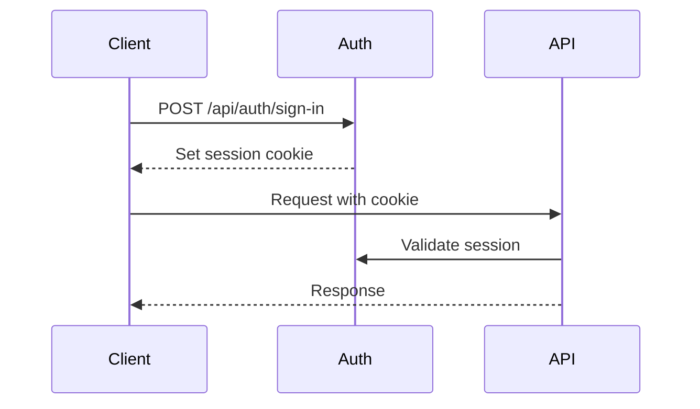

# Criterion: API Documentation

## Architecture Decision Record

### Status

**Status:** Accepted

**Date:** 2026-01-05

### Context

The API requires comprehensive documentation for developers integrating with Automaspec. Documentation must be interactive, always up-to-date with the implementation, and support multiple programming languages for code examples.

### Decision

We implemented API documentation using:

- **Specification**: OpenAPI 3.0 auto-generated from oRPC contracts
- **UI**: Scalar (interactive API explorer)
- **Endpoints**: `/rpc/docs` (UI), `/rpc/spec` (JSON spec)

### Alternatives Considered

| Alternative | Pros | Cons | Why Not Chosen |
|-------------|------|------|----------------|
| Swagger UI | Industry standard | Dated design, less interactive | Scalar is more modern |
| Redoc | Clean design | Less interactive testing | Scalar has better testing |
| Manual docs | Full control | Gets outdated, maintenance burden | Auto-generation preferred |

### Consequences

**Positive:**
- Documentation always matches implementation
- Interactive testing in browser
- No manual documentation maintenance

**Negative:**
- Limited customization compared to manual docs

## Implementation Details

### Documentation Access

| Resource | URL |
|----------|-----|
| Scalar UI | https://automaspec.vercel.app/rpc/docs |
| OpenAPI Spec | https://automaspec.vercel.app/rpc/spec |

### Features

- **Interactive endpoint testing**: Try API calls directly
- **Request/response schemas**: Visualized from Zod schemas
- **Authentication configuration**: Session-based auth setup
- **Multi-language examples**: JavaScript, Python, cURL, etc.

### API Categories

| Category | Endpoints | Description |
|----------|-----------|-------------|
| Test Folders | 7 | CRUD + hierarchy operations |
| Test Specs | 5 | CRUD for specifications |
| Test Requirements | 4 | CRUD for requirements |
| Tests | 6 | CRUD + report sync |
| Account | 2 | GDPR export/delete |
| AI Assistant | 1 | Chat with tools |
| Analytics | 1 | Organization metrics |

### Authentication Flow

## Requirements Checklist

| # | Requirement | Status | Evidence/Notes |
|---|-------------|--------|----------------|
| 1 | OpenAPI specification | ✅ | Auto-generated at /rpc/spec |
| 2 | Interactive documentation | ✅ | Scalar UI at /rpc/docs |
| 3 | Authentication docs | ✅ | Session-based flow documented |
| 4 | Request/response schemas | ✅ | Derived from Zod contracts |
| 5 | Error handling docs | ✅ | Error codes documented |
| 6 | Code examples | ✅ | Multi-language in Scalar |

## References

- [API Documentation Report](../../../docs_requirments/api-documentation-report.md)
- Live docs: https://automaspec.vercel.app/rpc/docs
