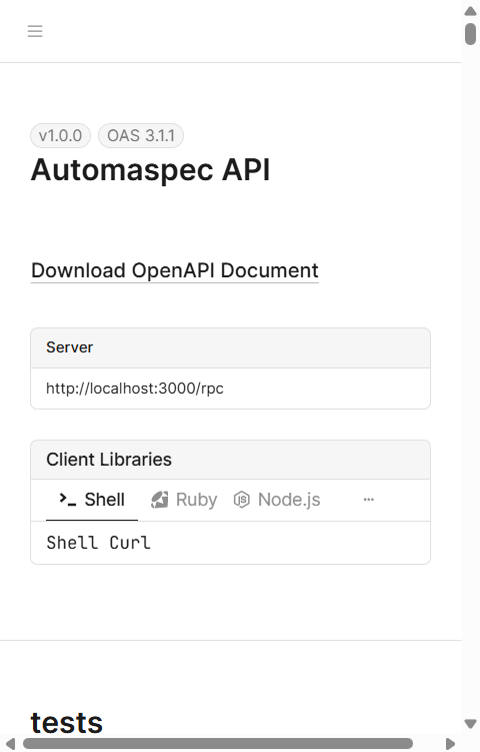

# Backend Report for Automaspec

## Overview

This report provides a comprehensive analysis of the Automaspec backend architecture, technology stack, and compliance with diploma project requirements.

---

## 1. Technology Stack

| Component | Technology | Version |
|-----------|------------|---------|
| **Framework** | Next.js (App Router) | 16.0.6 |
| **Language** | TypeScript | 5.9.3 |
| **ORM** | Drizzle ORM | 0.44.7 |
| **Database** | Turso (SQLite) | libsql 0.15.15 |
| **RPC Framework** | oRPC | 1.12.2 |
| **Authentication** | Better Auth | 1.4.4 |
| **Validation** | Zod | 4.1.13 |
| **Testing** | Vitest | 4.0.14 |
| **Logging** | Pino | 10.1.0 |
| **API Documentation** | Scalar (OpenAPI) | via oRPC plugins |

---

## 2. Architecture Overview

### 2.1 Layered Architecture

```
app/(backend)/rpc/[...all]/route.ts    <- Presentation Layer (API Routes)
    |
orpc/routes/*.ts                       <- Business Logic Layer
    |
orpc/contracts/*.ts                    <- Contract Layer (API Contracts)
    |
db/schema/*.ts + Drizzle ORM           <- Data Access Layer
    |
Turso (SQLite)                         <- Database Layer
```

### 2.2 Key Files

- **API Entry Point**: [app/(backend)/rpc/[...all]/route.ts](../app/(backend)/rpc/[...all]/route.ts)
- **Router Definition**: [orpc/routes/index.ts](../orpc/routes/index.ts)
- **Contracts**: [orpc/contracts/index.ts](../orpc/contracts/index.ts)
- **Database Schema**: [db/schema/index.ts](../db/schema/index.ts)
- **Middleware**: [orpc/middleware.ts](../orpc/middleware.ts)
- **Context**: [lib/orpc/context.ts](../lib/orpc/context.ts)

---

## 3. API Endpoints

### 3.1 Test Management (`/rpc/test-folders/*`, `/rpc/test-specs/*`, etc.)

| Method | Path | Description |
|--------|------|-------------|
| GET | `/test-folders/{id}` | Get folder by ID |
| GET | `/test-folders` | List folders |
| GET | `/test-folders/{folderId}/children` | Get folder children (recursive) |
| POST | `/test-folders/{id}` | Create/update folder |
| DELETE | `/test-folders/{id}` | Delete folder |
| GET | `/test-specs/{id}` | Get spec by ID |
| GET | `/test-specs` | List specs |
| PUT | `/test-specs/{id}` | Create/update spec |
| DELETE | `/test-specs/{id}` | Delete spec |
| GET | `/test-requirements` | List requirements |
| PUT | `/test-requirements/{id}` | Create/update requirement |
| DELETE | `/test-requirements/{id}` | Delete requirement |
| GET | `/tests` | List tests |
| PUT | `/tests/{id}` | Create/update test |
| DELETE | `/tests/{id}` | Delete test |
| POST | `/tests/sync-report` | Sync Vitest report |
| GET | `/tests/report` | Get test report |

### 3.2 Account Management (`/rpc/account/*`)

| Method | Path | Description |
|--------|------|-------------|
| GET | `/account/{userId}` | Export account data (GDPR) |
| DELETE | `/account/{userId}` | Delete account |

### 3.3 Authentication (`/api/auth/*`)

Handled by Better Auth with organization plugin support.

---

## 4. Database Schema

### 4.1 Core Tables

**Test Management:**
- `test_folder` - Hierarchical folder structure
- `test_spec` - Test specifications with status aggregation
- `test_requirement` - Requirements within specs
- `test` - Individual test cases

**Authentication (Better Auth):**
- `user` - User accounts
- `account` - OAuth accounts
- `session` - Active sessions
- `organization` - Organizations/teams
- `member` - Organization membership
- `invitation` - Pending invitations
- `verification` - Email verification

### 4.2 Key Features

- **Timestamps**: Automatic `created_at`/`updated_at` via SQL defaults
- **Cascading Deletes**: Foreign key constraints with `ON DELETE CASCADE`
- **Organization Isolation**: All test data scoped by `organizationId`
- **Status Aggregation**: `testSpec.statuses` stores JSON counts

---

## 5. Security Implementation

### 5.1 Authentication

- Email/password authentication via Better Auth
- Session-based authentication with secure cookies
- bcrypt password hashing (industry standard)

### 5.2 Authorization

- **Auth Middleware**: Validates session existence
- **Organization Middleware**: Ensures active organization context
- Role-based access: Owner, Admin, Member

### 5.3 Input Validation

- All inputs validated via Zod schemas
- Type-safe contracts via oRPC
- SQL injection protection via Drizzle ORM (parameterized queries)

---

## 6. Error Handling

### 6.1 Global Error Handler

```typescript
interceptors: [
    onError((error: any) => {
        console.error('RPC Error:', error)
        if (error.cause && error.cause.issues) {
            console.error('Validation Issues:', ...)
        }
    })
]
```

### 6.2 Custom Errors

Using `ORPCError` for business logic errors with proper HTTP status codes.

---

## 7. Logging

### 7.1 Implementation

```typescript
const logger = pino(pretty({ colorize: true, translateTime: 'HH:MM:ss.l' }))

new LoggingHandlerPlugin({
    logger,
    generateId: () => crypto.randomUUID(),
    logRequestResponse: true,
    logRequestAbort: true
})
```

---

## 8. API Documentation

- Auto-generated OpenAPI spec via `OpenAPIReferencePlugin`
- Interactive docs at `/rpc/docs` (Scalar UI)
- Spec available at `/rpc/spec`

### Screenshots

**API Documentation Overview:**



**API Endpoints List (Sidebar):**


**Endpoint Details with Schema:**


---

## 9. Containerization

Dockerfile included with multi-stage build:

1. **deps**: Install dependencies
2. **builder**: Build Next.js application
3. **runner**: Production runtime (standalone output)

---

## 10. Testing

### 10.1 Test Structure

```
__tests__/
├── components/          - UI component tests
├── db/                  - Schema validation tests
├── integration/         - Workflow tests
├── lib/                 - Utility tests
└── orpc/routes/         - API route tests
```

### 10.2 Coverage

- 11 test files
- 49 tests passing
- Unit tests for business logic
- Integration tests for workflows

---

## 11. Compliance with Diploma Requirements

### Minimum Requirements Checklist

| # | Requirement | Status | Implementation |
|---|-------------|--------|----------------|
| 1 | Modern Framework | YES | Next.js 16 (Node.js) |
| 2 | Database | YES | Turso (SQLite) |
| 3 | ORM | YES | Drizzle ORM |
| 4 | Layered Architecture | YES | Routes/Contracts/DB layers |
| 5 | SOLID Principles | PARTIAL | SRP, DIP followed; pure functions |
| 6 | API Documentation | YES | OpenAPI/Scalar at `/rpc/docs` |
| 7 | Global Error Handling | YES | oRPC interceptors |
| 8 | Logging | YES | Pino with structured logs |
| 9 | Production Deployment | PENDING | Dockerfile ready, Vercel config |
| 10 | Test Coverage | NEEDS WORK | ~49 tests, coverage % unknown |

### Security Checklist

| Check | Status | Notes |
|-------|--------|-------|
| No unsafe hashing (MD5/SHA1) | YES | bcrypt via Better Auth |
| No plaintext passwords | YES | Hashed in DB |
| Input validation | YES | Zod schemas |
| SQL injection protection | YES | Drizzle ORM |
| No hardcoded secrets | YES | Environment variables |
| JSON data format | YES | All API responses |
| Git version control | YES | Full history |

### Negative Checks (No deductions)

| Issue | Status |
|-------|--------|
| Magic strings | PASS - Constants in `lib/constants.ts` |
| Code duplication | PASS - DRY principles followed |
| Monolithic code | PASS - Modular structure |
| HTTP codes | PASS - Proper status codes |
| API stubs | PASS - Real DB interactions |

---

## 12. Recommendations for Improvement

1. **Test Coverage**: Run `vitest --coverage` to measure and reach 70% minimum
2. **CI/CD**: Add GitHub Actions workflow for automated testing/deployment
3. **Monitoring**: Consider adding health check endpoint
4. **Rate Limiting**: Implement via middleware for production

---

## 13. Conclusion

The Automaspec backend demonstrates a well-structured, modern architecture using Next.js with oRPC for type-safe APIs. The implementation follows most SOLID principles through functional programming patterns (no classes), proper layering, and clean separation of concerns.

**Strengths:**
- Type-safe end-to-end with TypeScript and Zod
- Modern ORM with migration support
- Comprehensive API documentation
- Proper authentication/authorization
- Structured logging

**Areas for Diploma Defense:**
- Measure and document test coverage percentage
- Deploy to production environment
- Add CI/CD pipeline for maximum points

