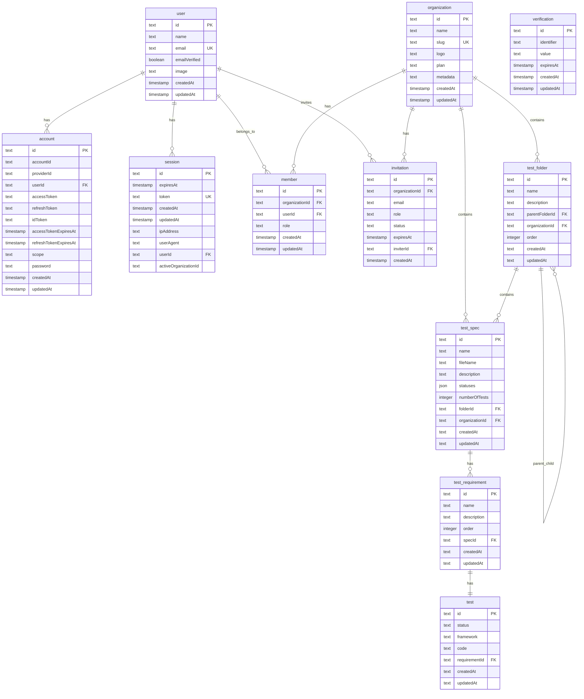

# Database Report for Automaspec

## Overview

This report provides comprehensive documentation of the Automaspec database architecture, schema design, and compliance with diploma project requirements for OLTP transactional databases.

---

## 1. Technology Stack

| Component | Technology | Version |
|-----------|------------|---------|
| **DBMS** | Turso (Distributed SQLite) | libsql 0.15.15 |
| **ORM** | Drizzle ORM | 0.44.7 |
| **Migration Tool** | Drizzle Kit | 0.44.7 |
| **Schema Definition** | TypeScript | 5.9.3 |
| **Validation** | Zod (via drizzle-zod) | 4.1.13 |

### 1.1 DBMS Selection Justification

**Turso (SQLite-based)** was chosen for the following reasons:

1. **Edge Distribution**: Turso provides global edge replication, reducing latency for users worldwide
2. **Serverless Compatibility**: Works seamlessly with Next.js and Cloudflare edge deployments
3. **Cost Efficiency**: Free tier sufficient for MVP with generous read/write quotas
4. **SQLite Compatibility**: Full SQL support with ACID transactions
5. **Drizzle ORM Integration**: First-class TypeScript support with type-safe queries

**Note**: While SQLite has limitations for heavy OLAP workloads, Automaspec is an OLTP application focused on transactional operations (CRUD for test specifications), making SQLite an appropriate choice.

---

## 2. Logical Schema

### 2.1 ER Diagram



### 2.2 Physical ER Diagram

See [diagram.pdf](../diagram.pdf) for the original database diagram.

**Diagram Accuracy Note**: The diagram is current with one minor clarification:
- `test_folder.parentFolderId` is nullable (allows root-level folders)

---

## 3. Data Dictionary

### 3.1 Authentication Layer (Better Auth)

#### Table: `user`

| Column | Type | Constraints | Description |
|--------|------|-------------|-------------|
| id | TEXT | PK, NOT NULL | Unique user identifier |
| name | TEXT | NOT NULL | User display name |
| email | TEXT | NOT NULL, UNIQUE | User email address |
| emailVerified | INTEGER | NOT NULL | Boolean flag for email verification |
| image | TEXT | - | Profile image URL |
| createdAt | INTEGER | NOT NULL | Account creation timestamp |
| updatedAt | INTEGER | NOT NULL | Last update timestamp |

#### Table: `account`

| Column | Type | Constraints | Description |
|--------|------|-------------|-------------|
| id | TEXT | PK, NOT NULL | Unique account identifier |
| accountId | TEXT | NOT NULL | External account ID (OAuth) |
| providerId | TEXT | NOT NULL | Auth provider (credential, google, github) |
| userId | TEXT | FK → user.id, NOT NULL, ON DELETE CASCADE | Associated user |
| accessToken | TEXT | - | OAuth access token |
| refreshToken | TEXT | - | OAuth refresh token |
| idToken | TEXT | - | OAuth ID token |
| accessTokenExpiresAt | INTEGER | - | Token expiration timestamp |
| refreshTokenExpiresAt | INTEGER | - | Refresh token expiration |
| scope | TEXT | - | OAuth scopes |
| password | TEXT | - | Hashed password (bcrypt) |
| createdAt | INTEGER | NOT NULL | Creation timestamp |
| updatedAt | INTEGER | NOT NULL | Update timestamp |

#### Table: `session`

| Column | Type | Constraints | Description |
|--------|------|-------------|-------------|
| id | TEXT | PK, NOT NULL | Unique session identifier |
| expiresAt | INTEGER | NOT NULL | Session expiration timestamp |
| token | TEXT | NOT NULL, UNIQUE | Session token |
| createdAt | INTEGER | NOT NULL | Session creation timestamp |
| updatedAt | INTEGER | NOT NULL | Last activity timestamp |
| ipAddress | TEXT | - | Client IP address |
| userAgent | TEXT | - | Browser user agent |
| userId | TEXT | FK → user.id, NOT NULL, ON DELETE CASCADE | Session owner |
| activeOrganizationId | TEXT | - | Currently active organization |

#### Table: `organization`

| Column | Type | Constraints | Description |
|--------|------|-------------|-------------|
| id | TEXT | PK, NOT NULL | Unique organization identifier |
| name | TEXT | NOT NULL | Organization display name |
| slug | TEXT | UNIQUE | URL-friendly identifier |
| logo | TEXT | - | Organization logo URL |
| plan | TEXT | NOT NULL, DEFAULT 'free' | Subscription plan (free/pro/enterprise) |
| metadata | TEXT | - | Additional JSON metadata |
| createdAt | INTEGER | - | Creation timestamp |
| updatedAt | INTEGER | - | Update timestamp |

#### Table: `member`

| Column | Type | Constraints | Description |
|--------|------|-------------|-------------|
| id | TEXT | PK, NOT NULL | Unique membership identifier |
| organizationId | TEXT | FK → organization.id, NOT NULL, ON DELETE CASCADE | Organization reference |
| userId | TEXT | FK → user.id, NOT NULL, ON DELETE CASCADE | User reference |
| role | TEXT | NOT NULL, DEFAULT 'member' | Role (owner/admin/member) |
| createdAt | INTEGER | - | Membership creation timestamp |
| updatedAt | INTEGER | - | Update timestamp |

#### Table: `invitation`

| Column | Type | Constraints | Description |
|--------|------|-------------|-------------|
| id | TEXT | PK, NOT NULL | Unique invitation identifier |
| organizationId | TEXT | FK → organization.id, NOT NULL, ON DELETE CASCADE | Target organization |
| email | TEXT | NOT NULL | Invitee email address |
| role | TEXT | - | Assigned role upon acceptance |
| status | TEXT | NOT NULL, DEFAULT 'pending' | Invitation status |
| expiresAt | INTEGER | NOT NULL | Expiration timestamp |
| inviterId | TEXT | FK → user.id, NOT NULL, ON DELETE CASCADE | Inviting user |
| createdAt | INTEGER | - | Creation timestamp |

#### Table: `verification`

| Column | Type | Constraints | Description |
|--------|------|-------------|-------------|
| id | TEXT | PK, NOT NULL | Unique verification identifier |
| identifier | TEXT | NOT NULL | Verification target (email) |
| value | TEXT | NOT NULL | Verification token/code |
| expiresAt | INTEGER | NOT NULL | Token expiration |
| createdAt | INTEGER | - | Creation timestamp |
| updatedAt | INTEGER | - | Update timestamp |

### 3.2 Test Management Layer

#### Table: `test_folder`

| Column | Type | Constraints | Description |
|--------|------|-------------|-------------|
| id | TEXT | PK, NOT NULL | Unique folder identifier |
| name | TEXT | NOT NULL | Folder display name |
| description | TEXT | - | Folder description |
| parentFolderId | TEXT | FK → test_folder.id (self-ref) | Parent folder for nesting |
| organizationId | TEXT | FK → organization.id, NOT NULL, ON DELETE CASCADE | Owning organization |
| order | INTEGER | NOT NULL, DEFAULT 0 | Sort order within parent |
| createdAt | TEXT | NOT NULL, DEFAULT CURRENT_TIMESTAMP | Creation timestamp |
| updatedAt | TEXT | NOT NULL, DEFAULT CURRENT_TIMESTAMP | Update timestamp (auto-update) |

#### Table: `test_spec`

| Column | Type | Constraints | Description |
|--------|------|-------------|-------------|
| id | TEXT | PK, NOT NULL | Unique spec identifier |
| name | TEXT | NOT NULL | Test specification name |
| fileName | TEXT | - | Associated test file name |
| description | TEXT | - | Detailed description |
| statuses | TEXT (JSON) | NOT NULL, DEFAULT {...} | Aggregated status counts |
| numberOfTests | INTEGER | NOT NULL, DEFAULT 0 | Total test count |
| folderId | TEXT | FK → test_folder.id, ON DELETE CASCADE | Parent folder |
| organizationId | TEXT | FK → organization.id, NOT NULL, ON DELETE CASCADE | Owning organization |
| createdAt | TEXT | NOT NULL, DEFAULT CURRENT_TIMESTAMP | Creation timestamp |
| updatedAt | TEXT | NOT NULL, DEFAULT CURRENT_TIMESTAMP | Update timestamp |

**Status JSON Structure:**
```json
{
  "passed": 0,
  "failed": 0,
  "pending": 0,
  "skipped": 0,
  "todo": 0,
  "disabled": 0,
  "missing": 0,
  "deactivated": 0,
  "partial": 0
}
```

#### Table: `test_requirement`

| Column | Type | Constraints | Description |
|--------|------|-------------|-------------|
| id | TEXT | PK, NOT NULL | Unique requirement identifier |
| name | TEXT | NOT NULL | Requirement description |
| description | TEXT | - | Detailed description |
| order | INTEGER | NOT NULL, DEFAULT 0 | Sort order within spec |
| specId | TEXT | FK → test_spec.id, NOT NULL, ON DELETE CASCADE | Parent specification |
| createdAt | TEXT | NOT NULL, DEFAULT CURRENT_TIMESTAMP | Creation timestamp |
| updatedAt | TEXT | NOT NULL, DEFAULT CURRENT_TIMESTAMP | Update timestamp |

#### Table: `test`

| Column | Type | Constraints | Description |
|--------|------|-------------|-------------|
| id | TEXT | PK, NOT NULL | Unique test identifier |
| status | TEXT | NOT NULL | Test status (passed/failed/pending/...) |
| framework | TEXT | NOT NULL | Test framework (vitest) |
| code | TEXT | - | Test source code |
| requirementId | TEXT | FK → test_requirement.id, NOT NULL, ON DELETE CASCADE | Parent requirement |
| createdAt | TEXT | NOT NULL, DEFAULT CURRENT_TIMESTAMP | Creation timestamp |
| updatedAt | TEXT | NOT NULL, DEFAULT CURRENT_TIMESTAMP | Update timestamp |

---

## 4. Normalization Analysis

### 4.1 Third Normal Form (3NF) Compliance

The database schema is normalized to 3NF:

**First Normal Form (1NF):**
- All tables have atomic values in each column
- Each table has a primary key
- No repeating groups

**Second Normal Form (2NF):**
- All non-key attributes depend on the entire primary key
- No partial dependencies (all PKs are single-column)

**Third Normal Form (3NF):**
- No transitive dependencies
- All non-key attributes depend only on the primary key

**Deliberate Denormalization:**
- `test_spec.statuses`: JSON field storing aggregated status counts for performance
  - **Justification**: Avoids expensive COUNT queries on every spec display
  - **Maintained by**: Application logic updates on test status changes

---

## 5. Relationships and Constraints

### 5.1 Foreign Key Relationships

| Source Table | Source Column | Target Table | Target Column | On Delete |
|--------------|---------------|--------------|---------------|-----------|
| account | userId | user | id | CASCADE |
| session | userId | user | id | CASCADE |
| member | organizationId | organization | id | CASCADE |
| member | userId | user | id | CASCADE |
| invitation | organizationId | organization | id | CASCADE |
| invitation | inviterId | user | id | CASCADE |
| test_folder | parentFolderId | test_folder | id | - |
| test_folder | organizationId | organization | id | CASCADE |
| test_spec | folderId | test_folder | id | CASCADE |
| test_spec | organizationId | organization | id | CASCADE |
| test_requirement | specId | test_spec | id | CASCADE |
| test | requirementId | test_requirement | id | CASCADE |

### 5.2 Unique Constraints

| Table | Column(s) | Description |
|-------|-----------|-------------|
| user | email | One account per email |
| organization | slug | Unique URL slugs |
| session | token | Unique session tokens |

### 5.3 Default Values

| Table | Column | Default |
|-------|--------|---------|
| organization.plan | - | 'free' |
| member.role | - | 'member' |
| invitation.status | - | 'pending' |
| test_folder.order | - | 0 |
| test_spec.numberOfTests | - | 0 |
| test_spec.statuses | - | JSON with all counts = 0 |
| test_requirement.order | - | 0 |
| *.createdAt | - | CURRENT_TIMESTAMP |
| *.updatedAt | - | CURRENT_TIMESTAMP |

---

## 6. DDL Scripts and Migrations

### 6.1 Schema Definition Location

Schema is defined using Drizzle ORM TypeScript:

- **Authentication Schema**: [db/schema/auth.ts](../db/schema/auth.ts)
- **Test Management Schema**: [db/schema/tests.ts](../db/schema/tests.ts)
- **Index Export**: [db/schema/index.ts](../db/schema/index.ts)

### 6.2 Migration Files

Migrations are stored in `db/migrations/`:

| Migration | Description |
|-----------|-------------|
| 0000_unknown_genesis.sql | Initial schema with unique indexes |
| 0001_organic_warpath.sql | Remove parentFolderId column |
| 0002_lean_juggernaut.sql | Re-add parentFolderId as nullable |

### 6.3 Migration Configuration

```typescript
// drizzle.config.ts
export default defineConfig({
    schema: './db/schema',
    out: './db/migrations',
    dialect: 'turso',
    casing: 'snake_case',
    dbCredentials: {
        url: process.env.NEXT_PUBLIC_DATABASE_URL ?? '',
        authToken: process.env.DATABASE_AUTH_TOKEN
    }
})
```

### 6.4 Version Control

All migrations are tracked in Git with journal metadata:

```
db/migrations/meta/_journal.json
```

---

## 7. Data Integrity

### 7.1 Referential Integrity

- **Cascading Deletes**: All foreign keys use `ON DELETE CASCADE`
- **Organization Isolation**: All test data requires `organizationId`
- **Hierarchical Integrity**: Folder deletion cascades to specs, requirements, and tests

### 7.2 Transaction Support

Drizzle ORM provides transaction support:

```typescript
await db.transaction(async (tx) => {
    await tx.insert(testSpec).values({...})
    await tx.insert(testRequirement).values({...})
})
```

### 7.3 Timestamp Automation

- `createdAt`: Set automatically via SQL `DEFAULT CURRENT_TIMESTAMP`
- `updatedAt`: Updated via Drizzle's `$onUpdate()` modifier

---

## 8. Security Implementation

### 8.1 Password Storage

- **Algorithm**: bcrypt (via Better Auth)
- **Storage**: Hashed in `account.password` column
- **No plaintext**: Passwords never stored in clear text
- **No weak hashing**: MD5/SHA-1 not used

### 8.2 Authorization Model

Authorization is implemented at the **application level** via oRPC middleware:

```typescript
// orpc/middleware.ts
export const authMiddleware = os.middleware(async ({ context, next }) => {
    const session = await auth.api.getSession({ headers: context.headers })
    if (!session) throw new ORPCError('UNAUTHORIZED')
    return next({ context: { ...context, session } })
})

export const organizationMiddleware = os.middleware(async ({ context, next }) => {
    const organizationId = context.session.session.activeOrganizationId
    if (!organizationId) throw new ORPCError('FORBIDDEN')
    return next({ context: { ...context, organizationId } })
})
```

**Role Hierarchy:**
| Role | Permissions |
|------|-------------|
| owner | Full access, can delete organization |
| admin | Manage members, full CRUD on specs |
| member | Read/write specs within organization |

**Justification for Application-Level Authorization:**
- Turso (edge SQLite) does not support traditional database roles
- Application-level middleware provides equivalent security
- All queries are scoped by `organizationId` preventing cross-tenant access
- This pattern is standard for serverless/edge deployments

### 8.3 SQL Injection Protection

- All queries use Drizzle ORM parameterized queries
- No raw SQL string concatenation
- Input validation via Zod schemas before database operations

---

## 9. Test Data

### 9.1 Sample Data Script

Location: [db/sample_data.sql](../db/sample_data.sql)

Includes:
- 5 test folders (Dashboard Tests, Authentication, Test Management, API Routes, Organization Management)
- 8 test specifications with realistic statuses
- 25 test requirements
- 25 test cases with actual Vitest code examples

### 9.2 Sample Data Summary

| Entity | Count | Description |
|--------|-------|-------------|
| test_folder | 5 | Root-level folders |
| test_spec | 8 | Test specification documents |
| test_requirement | 25 | Individual requirements |
| test | 25 | Test implementations |

---

## 10. Compliance Checklist

### 10.1 Minimum Requirements (5 Points)

| # | Requirement | Status | Evidence |
|---|-------------|--------|----------|
| 1 | **Documentation** | | |
| 1.1 | Data dictionary | YES | Section 3 of this document |
| 1.2 | Data integrity description | YES | Section 7 |
| 1.3 | ER diagram | YES | Section 2.1 (Mermaid) + diagram.pdf |
| 1.4 | DDL scripts | YES | db/migrations/*.sql |
| 2 | **Design** | | |
| 2.1 | Modern RDBMS | YES | Turso (SQLite) |
| 2.2 | 3NF normalization | YES | Section 4 |
| 2.3 | Sufficient tables | YES | 11 tables with varied relationships |
| 2.4 | Primary keys | YES | All tables have text PKs |
| 2.5 | Foreign keys | YES | 12 FK relationships with CASCADE |
| 2.6 | Constraints | YES | NOT NULL, UNIQUE, DEFAULT |
| 2.7 | Appropriate data types | YES | TEXT, INTEGER, JSON as needed |
| 3 | **Deployment** | | |
| 3.1 | Migrations via scripts | YES | Drizzle Kit migrations |
| 3.2 | Version control | YES | Git repository |
| 4 | **Test Data** | | |
| 4.1 | Sufficient test records | YES | 25+ records per major table |
| 4.2 | Reference data scripts | YES | db/sample_data.sql |
| 5 | **Usage** | | |
| 5.1 | Roles and permissions | PARTIAL | Application-level via middleware |
| 5.2 | No superuser in app | YES | App uses auth tokens, not DB admin |
| 5.3 | Encrypted passwords | YES | bcrypt via Better Auth |
| 5.4 | Integrity via constraints | YES | FK constraints, NOT NULL |

### 10.2 Restrictions Compliance

| Restriction | Status | Notes |
|-------------|--------|-------|
| No plaintext passwords | PASS | bcrypt hashing |
| No CSV/Excel as storage | PASS | Turso RDBMS used |
| No unstructured JSON without schema | PASS | JSON in `statuses` is well-defined |
| Data integrity enforced | PASS | FK constraints, transactions |

### 10.3 Maximum Requirements (10 Points)

| # | Requirement | Status | Notes |
|---|-------------|--------|-------|
| 1 | Multiple DBMS types | N/A | Single OLTP use case |
| 2 | Data layers (raw→staging→mart) | N/A | Not an analytics project |
| 3 | Schema versioning | YES | Drizzle migrations + Git |
| 4 | Indexes | PARTIAL | Unique indexes on email, slug, token |
| 5 | Triggers/procedures | NO | Application-level logic preferred |
| 6 | Views | NO | ORM handles query abstraction |
| 7 | Data masking for PII | NO | Future consideration |

---

## 11. Recommendations

### 11.1 Current Strengths

1. **Type-Safe Schema**: Drizzle ORM provides compile-time type checking
2. **Migration Management**: Versioned migrations with rollback capability
3. **Cascade Integrity**: Proper foreign key relationships prevent orphaned data
4. **Multi-Tenant Isolation**: All data scoped by organizationId

### 11.2 Future Improvements

1. **Additional Indexes**: Add indexes on frequently queried columns:
   - `test_spec.organizationId`
   - `test_folder.organizationId`
   - `test.status`

2. **Audit Logging**: Consider adding an audit table for compliance:
   ```sql
   CREATE TABLE audit_log (
       id TEXT PRIMARY KEY,
       tableName TEXT NOT NULL,
       recordId TEXT NOT NULL,
       action TEXT NOT NULL,
       userId TEXT,
       timestamp TEXT DEFAULT CURRENT_TIMESTAMP
   )
   ```

3. **Soft Deletes**: Add `deletedAt` columns for recoverable deletions

4. **Data Masking**: Implement PII masking for GDPR compliance exports

---

## 12. Conclusion

The Automaspec database demonstrates a well-designed OLTP schema suitable for a test specification management platform. The implementation follows relational database best practices including:

- **Proper normalization** to 3NF with justified denormalization
- **Referential integrity** via foreign keys with cascading deletes
- **Security** through application-level authorization and bcrypt password hashing
- **Maintainability** via TypeScript schema definitions and versioned migrations

The choice of Turso (distributed SQLite) is appropriate for the serverless architecture and provides adequate performance for the expected workload.

---

## Appendix A: Database Connection

```typescript
// db/index.ts
import { drizzle } from 'drizzle-orm/libsql'
import { createClient } from '@libsql/client'

const client = createClient({
    url: process.env.NEXT_PUBLIC_DATABASE_URL ?? '',
    authToken: process.env.DATABASE_AUTH_TOKEN
})

export const db = drizzle(client, { casing: 'snake_case' })
```

## Appendix B: Environment Variables

| Variable | Description |
|----------|-------------|
| NEXT_PUBLIC_DATABASE_URL | Turso database URL |
| DATABASE_AUTH_TOKEN | Turso authentication token |

---

**Document Prepared By:**  
Automaspec Development Team

**Date:**  
December 2025

**Status:**  
Final for Review

