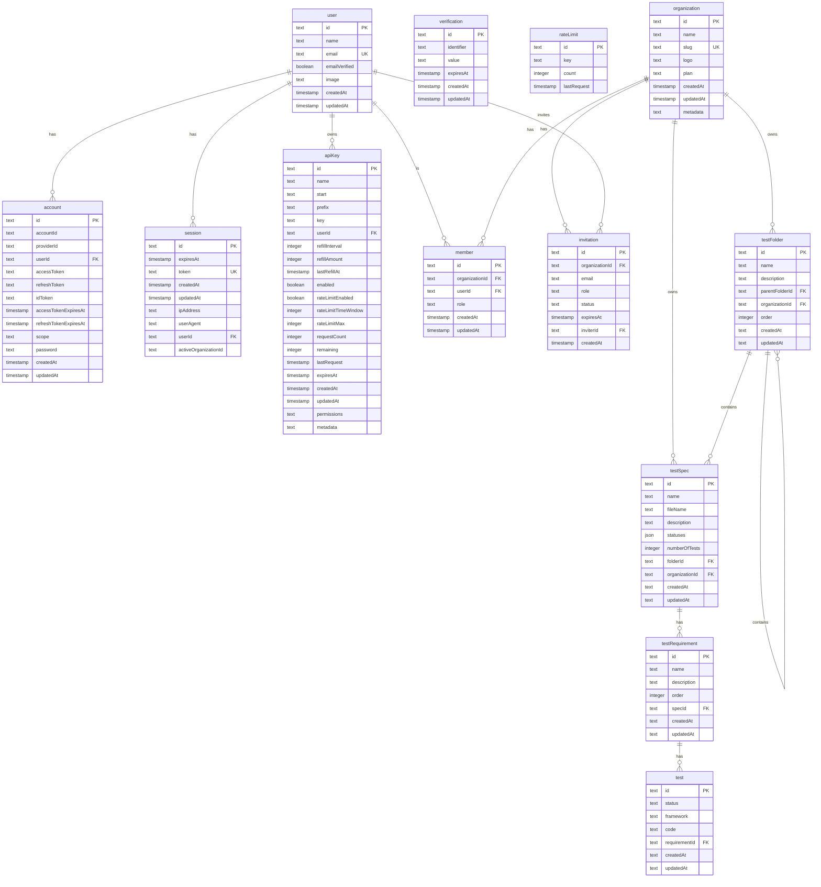

# Database Schema Diagram

## Entity Relationship Diagram



## Tables Overview

### Authentication & Users

| Table | Description |
|-------|-------------|
| `user` | Core user information including email, name, and verification status |
| `account` | OAuth provider accounts linked to users (supports multiple providers) |
| `session` | Active user sessions with tokens and metadata |
| `verification` | Email/phone verification tokens |
| `apiKey` | API keys for programmatic access with rate limiting |
| `rateLimit` | Rate limiting tracking for API requests |

### Organizations

| Table | Description |
|-------|-------------|
| `organization` | Organizations/workspaces with plans (free/paid) |
| `member` | User membership in organizations with roles (owner/admin/member) |
| `invitation` | Pending invitations to join organizations |

### Test Management

| Table | Description |
|-------|-------------|
| `testFolder` | Hierarchical folder structure for organizing specs (supports nesting) |
| `testSpec` | Test specifications containing requirements |
| `testRequirement` | Individual requirements within a spec |
| `test` | Actual test implementations linked to requirements |

## Key Relationships

### User → Account (1:N)
A user can have multiple linked accounts (Google, GitHub, etc.)

### User ↔ Organization (N:M via Member)
Users can belong to multiple organizations with different roles

### Organization → Test Structure
Each organization owns its own:
- Test folders (hierarchical)
- Test specs (can be in folders or root level)

### Test Hierarchy
```
Organization
└── TestFolder (recursive, can nest)
    └── TestSpec
        └── TestRequirement
            └── Test
```

## Notes

- All IDs use `text` type (UUIDs)
- Timestamps use SQLite integer mode for `auth` tables and text with `CURRENT_TIMESTAMP` for `test` tables
- Cascading deletes are configured for referential integrity
- The `testFolder.parentFolderId` creates a self-referential hierarchy for nested folders
