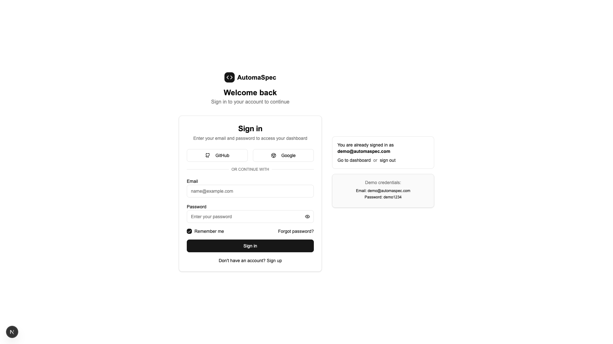
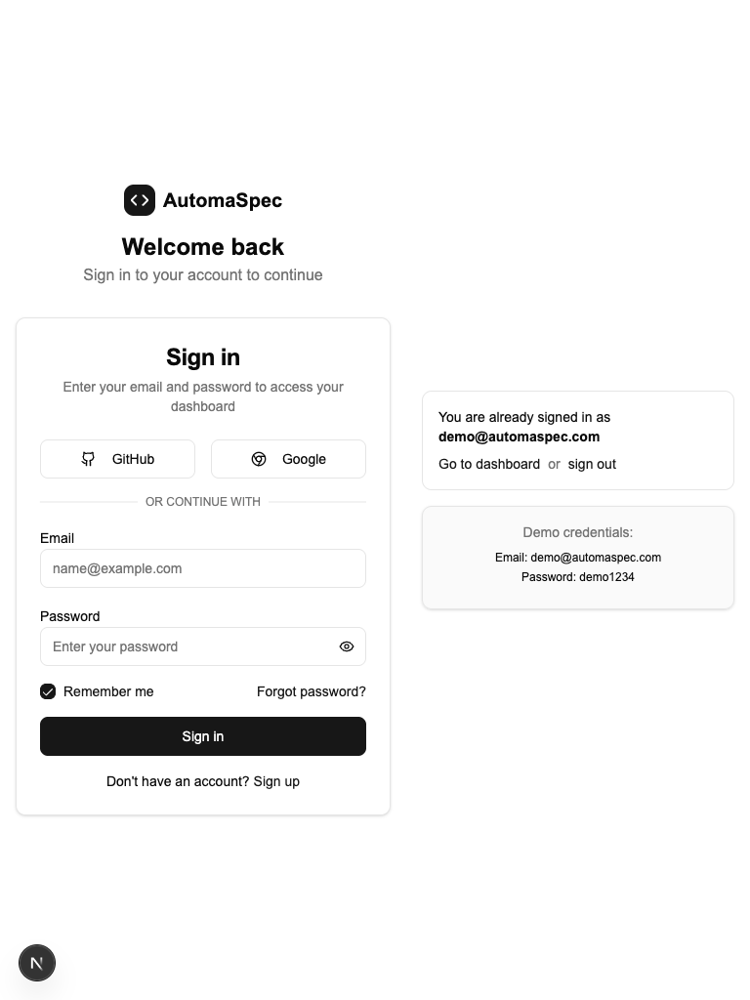
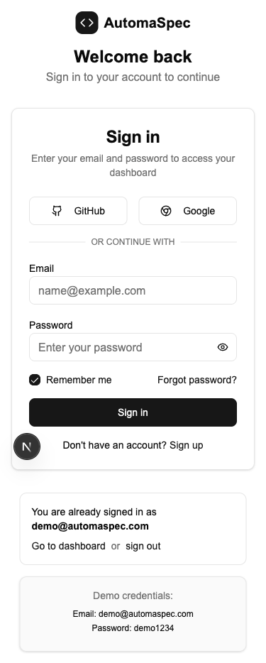
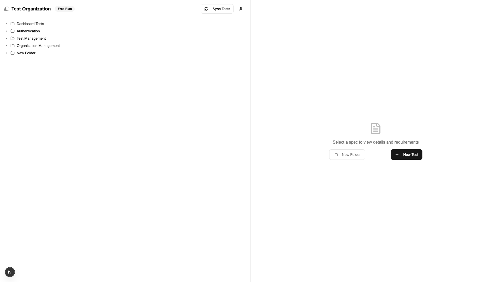

# Adaptive UI Documentation

## Overview

AutomaSpec implements a fully responsive interface that adapts seamlessly across mobile, tablet, and desktop devices while maintaining functionality and visual consistency.

---

## Device Support

### ✅ Three Device Types Supported

- **Mobile** (375px - 767px): Touch-optimized, single-column layout
- **Tablet** (768px - 1023px): Enhanced layouts with balanced information density  
- **Desktop** (1024px+): Full two-panel dashboard with maximum functionality

### Key Features

- ✅ Relative units throughout (rem, em, %, vw, vh)
- ✅ No overlapping elements at any screen size
- ✅ Correct functionality with browser zoom
- ✅ Responsive breakpoints: 640px, 768px, 1024px, 1280px, 1536px

---

## Visual Criteria

### Typography & Icons
- ✅ Scalable fonts using relative units
- ✅ SVG icons (Lucide React) - scale without distortion
- ✅ Unified typography across all devices
- ✅ Consistent color palette via CSS custom properties

### Interactive Elements
- ✅ Minimum 44px touch targets for mobile
- ✅ WCAG 2.1 AA contrast compliance (4.5:1 minimum)
- ✅ Accessible form elements and buttons

### Theme Support
- ✅ Light/Dark theme with smooth transitions
- ✅ System preference detection
- ✅ Theme toggle available throughout

---

## Structural Criteria

### Adaptive Layout
- ✅ Flexbox/Grid-based responsive system
- ✅ Blocks scale appropriately with screen width
- ✅ Navigation always accessible
- ✅ Mobile: Sheet-based sidebar
- ✅ Desktop: Fixed sidebar with collapse

### Component Library
- ✅ Reusable responsive components
- ✅ Size variants (sm, md, lg)
- ✅ Mobile-aware dialogs and sheets

---

## Screenshots

### Login Page

#### Desktop (1920×1080)
{width=1.0\textwidth}

**Features:**
- Centered layout with optimal spacing
- Full-width form elements
- Clear visual hierarchy

#### Tablet (768×1024)
{width=0.95\textwidth}

**Adaptations:**
- Maintained centered layout
- Touch-friendly buttons
- Readable typography

#### Mobile (375×667)
{width=0.95\textwidth}

**Adaptations:**
- Full-width form
- Stacked social login buttons
- Single-column layout

---

### Dashboard Page

#### Desktop (1920×1080)
{width=1.0\textwidth}

**Layout:**
- Two-panel layout (50/50 split)
- Tree navigation left, details panel right
- Full header navigation

#### Tablet (768×1024)
{width=0.95\textwidth}

**Adaptations:**
- Responsive panel widths
- Maintained two-column layout
- Touch-optimized interactions

#### Mobile (375×667)
{width=0.95\textwidth}

**Adaptations:**
- Single-column stacked layout
- Full-width panels
- Mobile-optimized navigation

---

## Technical Implementation

### Framework & Tools
- **Next.js 16** - React framework
- **Tailwind CSS 4** - Utility-first CSS
- **TypeScript** - Type safety
- **Lucide React** - SVG icons

### Responsive Features
- Custom `useIsMobile()` hook (breakpoint: 768px)
- Tailwind responsive utilities (`sm:`, `md:`, `lg:`)
- CSS custom properties for theming
- Container queries where applicable

### Browser Support
- ✅ Modern browsers (Chrome, Firefox, Safari, Edge)
- ✅ Mobile browsers (iOS Safari, Chrome Mobile)
- ✅ Full touch support

---

## Compliance Summary

### Minimum Requirements ✅
- ✅ 3 device types (mobile, tablet, desktop)
- ✅ Correct display at different resolutions
- ✅ Relative units throughout
- ✅ Scalable fonts and icons
- ✅ 44px+ touch targets
- ✅ WCAG 2.1 AA contrast
- ✅ Adaptive grid system
- ✅ Always accessible navigation

### Enhanced Features ✅
- ✅ Light/dark theme support
- ✅ SVG icons throughout
- ✅ System theme detection
- ✅ Smooth theme transitions
- ✅ Mobile-optimized layouts

---

## Conclusion

AutomaSpec provides a comprehensive adaptive UI that meets all requirements for responsive design, ensuring functional consistency, visual integrity, and optimal user experience across all device types.
