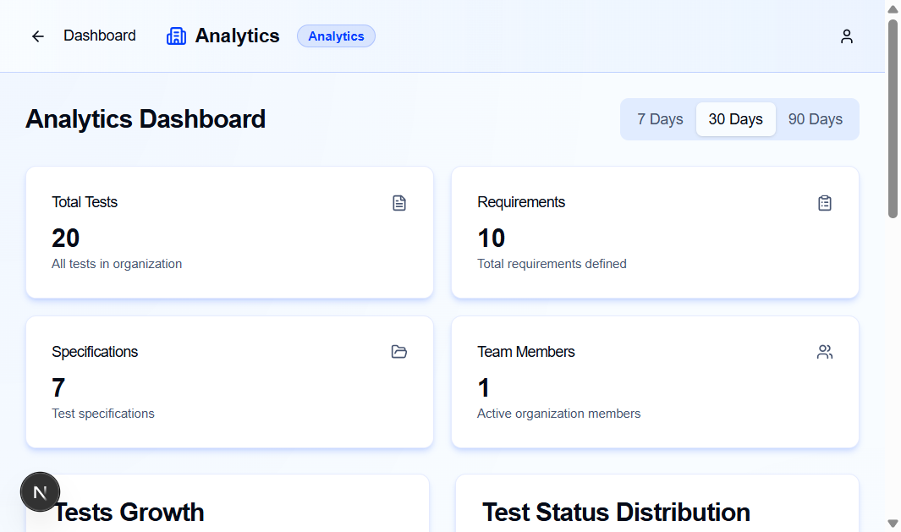
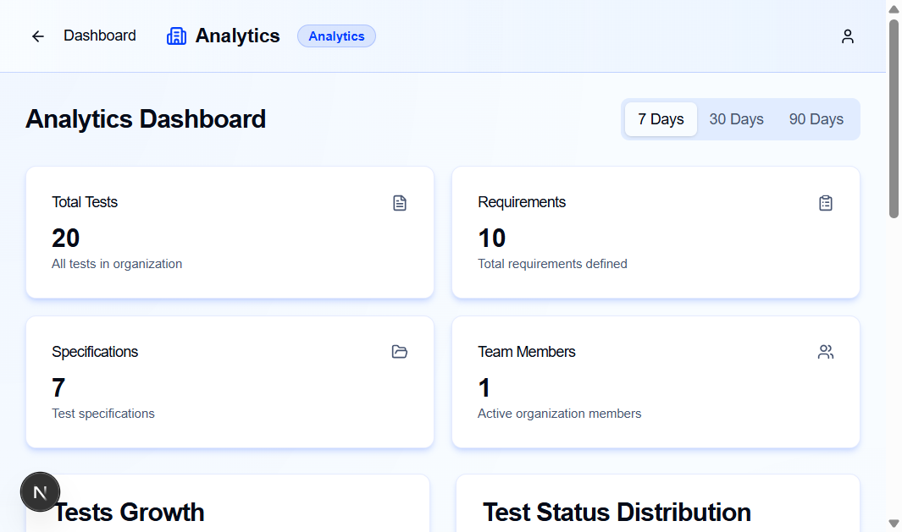
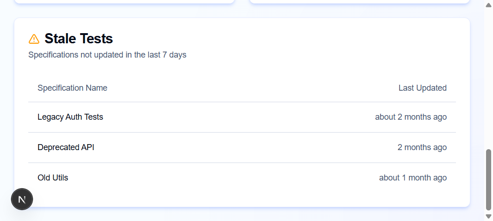

# Отчёт по реализации модуля аналитики

## Automaspec - Analytics Dashboard

**Дата:** Декабрь 2025  
**Версия:** 1.0

---

## 1. Введение

В рамках дипломной работы был реализован модуль аналитики для системы управления тестовыми спецификациями Automaspec. Данный модуль обеспечивает сбор, обработку и визуализацию пользовательских метрик, что полностью соответствует критерию «Сбор, обработка и визуализация пользовательских метрик, отчёты и графики».

---

## 2. Реализованный функционал

### 2.1 Расчёт ключевых метрик

На основе данных в базе формируются следующие метрики:

| Метрика | Описание |
|---------|----------|
| **Количество тестов** | Общее число тестов в организации |
| **Количество требований** | Общее число тестовых требований |
| **Количество спецификаций** | Общее число тестовых спецификаций |
| **Активные пользователи** | Количество членов команды в организации |
| **Распределение по статусам** | Тесты сгруппированные по статусам (passed, failed, pending и др.) |
| **Устаревшие тесты** | Спецификации, не обновлявшиеся за выбранный период |

### 2.2 Визуализация в виде Dashboard

Dashboard включает следующие компоненты:

1. **Карточки ключевых показателей (Metrics Cards)**
   - Total Tests - общее количество тестов
   - Requirements - количество требований
   - Specifications - количество спецификаций
   - Team Members - активные члены организации

2. **График роста числа тестов (Tests Growth Chart)**
   - Линейный график с точками данных
   - Отображает динамику создания тестов во времени
   - Интерактивный tooltip при наведении

3. **Диаграмма распределения по статусам (Status Distribution Chart)**
   - Визуализация тестов по статусам
   - Показывает passed, failed, pending, skipped, todo и другие статусы

4. **Таблица устаревших тестов (Stale Tests Table)**
   - Список спецификаций, не обновлявшихся за выбранный период
   - Отображает название спецификации и время последнего обновления

---

## 3. Архитектура решения

### 3.1 Backend (oRPC)

Серверная часть реализована с использованием oRPC framework:

```
orpc/routes/analytics.ts
```

**Эндпоинт:** `analytics.getMetrics`

**Входные параметры:**
- `period` - период для анализа (7d, 30d, 90d)

**Возвращаемые данные:**
- `totalTests` - общее количество тестов
- `totalRequirements` - количество требований
- `totalSpecs` - количество спецификаций
- `activeMembers` - активные пользователи
- `testsByStatus` - распределение по статусам
- `testsGrowth` - данные для графика роста
- `staleTests` - список устаревших спецификаций

### 3.2 Frontend (React + Next.js)

Клиентская часть построена на компонентной архитектуре:

```
app/analytics/
├── page.tsx                    # Главная страница
└── components/
    ├── analytics-header.tsx    # Заголовок
    ├── metrics-cards.tsx       # Карточки метрик
    ├── tests-growth-chart.tsx  # График роста
    ├── status-distribution-chart.tsx  # Диаграмма статусов
    └── stale-tests-table.tsx   # Таблица устаревших тестов
```

### 3.3 Визуализация (Recharts)

Для построения графиков используется библиотека Recharts:
- `LineChart` - для графика роста тестов
- `PieChart` / `BarChart` - для распределения по статусам

---

## 4. Скриншоты интерфейса

### 4.1 Dashboard с метриками (30 дней)



*Рисунок 1: Главная страница аналитики с карточками ключевых метрик*

### 4.2 Dashboard с выбором периода 7 дней



*Рисунок 2: Dashboard с выбранным периодом 7 дней*

### 4.3 Таблица устаревших тестов



*Рисунок 3: Таблица устаревших спецификаций с динамическим периодом*

---

## 5. Функциональные возможности

### 5.1 Выбор периода анализа

Пользователь может выбрать один из трёх периодов:
- **7 дней** - краткосрочный анализ
- **30 дней** - стандартный период (по умолчанию)
- **90 дней** - долгосрочный анализ

При смене периода автоматически пересчитываются:
- Данные графика роста тестов
- Список устаревших спецификаций
- Текст описания в таблице устаревших тестов

### 5.2 Интерактивные элементы

- **Графики** - при наведении отображается tooltip с точными значениями
- **Точки данных** - на графике роста отображаются точки для каждой даты
- **Tabs** - переключение между периодами без перезагрузки страницы

---

## 6. Технические детали

### 6.1 Используемые технологии

| Технология | Назначение |
|------------|------------|
| Next.js 16 | Framework для React |
| React 19 | UI библиотека |
| TypeScript | Типизация |
| Recharts | Визуализация данных |
| TanStack Query | Управление серверным состоянием |
| oRPC | API layer |
| Drizzle ORM | Работа с базой данных |
| Tailwind CSS | Стилизация |

### 6.2 Структура базы данных

Метрики собираются из следующих таблиц:
- `test_spec` - спецификации (statuses, updatedAt)
- `test_requirement` - требования
- `test` - тесты (status, createdAt)
- `member` - члены организации

### 6.3 Константы

```typescript
// lib/constants.ts
export const ANALYTICS_PERIODS = {
    '7d': 7,
    '30d': 30,
    '90d': 90
} as const
```

---

## 7. Соответствие требованиям

| Требование | Реализация | Статус |
|------------|------------|--------|
| Количество активных пользователей за период | Team Members карточка | ✅ |
| Количество созданных тестов и требований | Total Tests, Requirements карточки | ✅ |
| Распределение тестов по статусам | Status Distribution Chart | ✅ |
| «Возраст» тестов | Stale Tests Table | ✅ |
| График роста числа тестов | Tests Growth Chart | ✅ |
| Диаграмма распределения по статусам | Status Distribution Chart | ✅ |
| Карточки ключевых показателей | Metrics Cards | ✅ |
| Список устаревших тестов | Stale Tests Table с динамическим периодом | ✅ |

---

## 8. Заключение

Реализованный модуль аналитики полностью закрывает процесс сбора, обработки и визуализации пользовательских метрик. Dashboard обеспечивает прозрачное понимание активности пользователей и «здоровья» тестовых спецификаций.

Функционал соответствует заявленному критерию analytics и был реализован в рамках дипломной работы с использованием современных технологий и лучших практик разработки.

---

**Автор:** Студент  
**Проект:** Automaspec - Система управления тестовыми спецификациями

