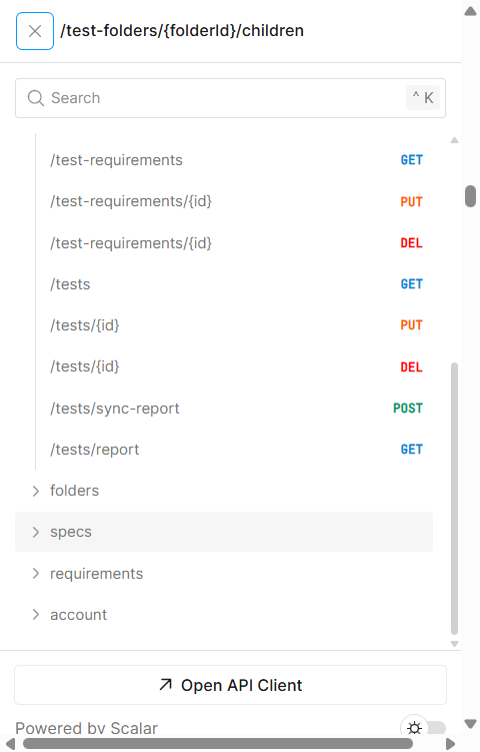
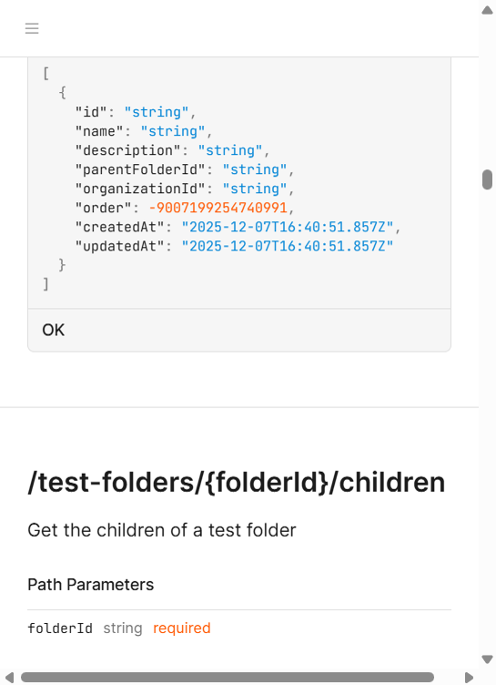
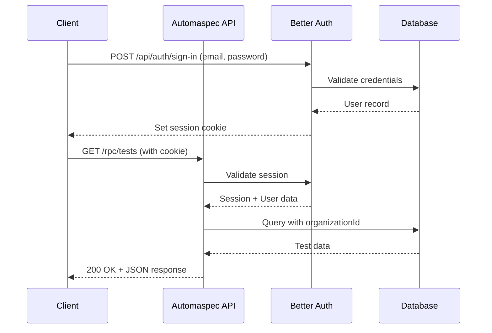
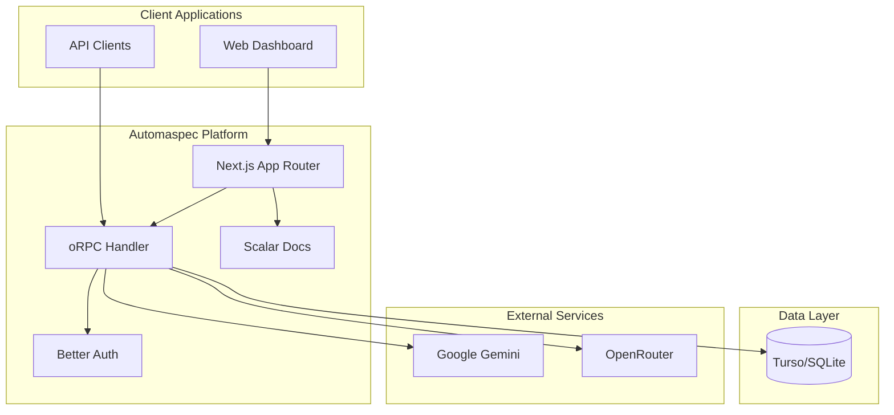
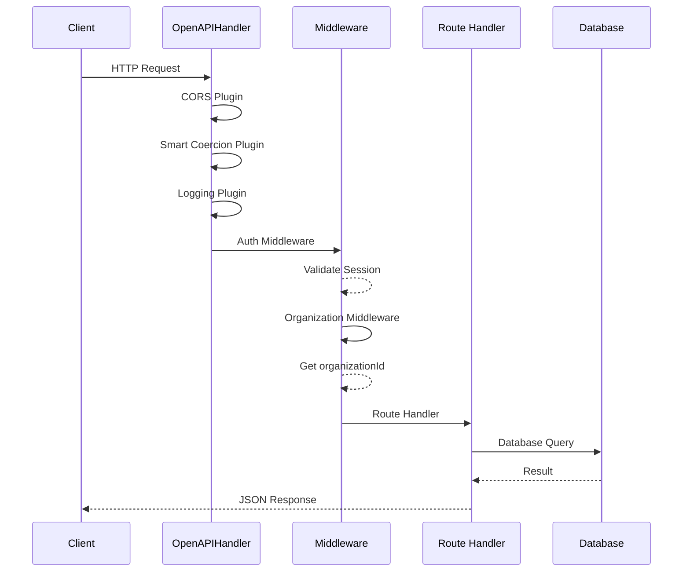
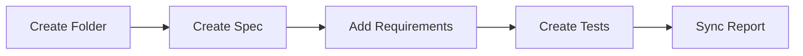

# Automaspec API Documentation

## Table of Contents

- [Overview](#overview)
- [Interactive Documentation](#interactive-documentation)
- [Authentication & Security](#authentication--security)
- [API Reference](#api-reference)
  - [Test Folders](#test-folders)
  - [Test Specs](#test-specs)
  - [Test Requirements](#test-requirements)
  - [Tests](#tests)
  - [Account Management](#account-management)
  - [AI Assistant](#ai-assistant)
  - [Analytics](#analytics)
- [Data Models](#data-models)
- [Error Handling](#error-handling)
- [Architecture Overview](#architecture-overview)
- [Getting Started Guide](#getting-started-guide)
- [Integration Tutorial](#integration-tutorial)
- [Advanced Topics](#advanced-topics)
- [Documentation Strategy](#documentation-strategy)
- [Compliance Checklist](#compliance-checklist)

---

## Overview

**Automaspec API** provides programmatic access to manage test specifications, requirements, and test cases organized in a hierarchical folder structure. The API supports multi-tenant organizations with role-based access control.

### Key Features

- **Test Management**: Organize tests in folders, specs, and requirements
- **Report Synchronization**: Sync Vitest test results with stored specifications
- **AI Assistant**: Intelligent copilot for test management tasks
- **Analytics**: Track test metrics, growth trends, and stale tests
- **Account Management**: GDPR-compliant data export and account deletion

### Technology Stack

| Component | Technology | Description |
|-----------|------------|-------------|
| **RPC Framework** | oRPC v1.13.2 | Type-safe RPC with OpenAPI generation |
| **Validation** | Zod v4.3.4 | Schema validation and TypeScript inference |
| **Authentication** | Better Auth v1.4.10 | Session-based auth with organization support |
| **Database** | Drizzle ORM + Turso | SQLite-compatible serverless database |
| **Documentation** | Scalar (OpenAPI) | Interactive API reference UI |

### Base URL

```
http://localhost:3000/rpc
```

---

## Interactive Documentation

> [!TIP]
> **Live API Documentation** is available at `/rpc/docs` powered by Scalar UI.

### Access Points

| Resource | URL | Description |
|----------|-----|-------------|
| **Scalar UI** | `/rpc/docs` | Interactive API explorer |
| **OpenAPI Spec** | `/rpc/spec` | JSON specification file |

The Scalar documentation provides:
- Interactive endpoint testing
- Request/response schema visualization
- Authentication configuration
- Code examples in multiple languages








---

## Authentication & Security

### Authentication Flow

All API endpoints require authentication via session cookies managed by Better Auth.



### Session-Based Authentication

```http
Cookie: better-auth.session_token=<session_token>
```

The session token is automatically set upon successful login at `/api/auth/sign-in`.

### Authorization Middleware

All endpoints pass through two middleware layers:

1. **Auth Middleware**: Validates session existence
   - Returns error if no valid session

2. **Organization Middleware**: Ensures active organization context
   - Returns error if user has no active organization
   - Scopes all data queries to the organization

### Role-Based Access Control

| Role | Permissions |
|------|-------------|
| **Owner** | Full access, manage organization |
| **Admin** | Manage members, all CRUD operations |
| **Member** | Read/write tests and specs |

### Security Features

- **Password Hashing**: bcrypt (industry standard)
- **Session Management**: Secure HTTP-only cookies
- **Input Validation**: All inputs validated via Zod schemas
- **SQL Injection Protection**: Drizzle ORM parameterized queries
- **Organization Isolation**: All test data scoped by `organizationId`

---

## API Reference

### HTTP Status Codes

| Code | Meaning |
|------|---------|
| `200` | Success |
| `400` | Bad Request - Invalid input |
| `401` | Unauthorized - No valid session |
| `403` | Forbidden - No active organization |
| `404` | Not Found - Resource doesn't exist |
| `500` | Server Error - Internal error |

---

### Test Folders

Organize test specifications in a hierarchical folder structure.

#### GET `/test-folders/{id}`

Retrieves a single test folder by ID.

**Parameters:**

| Name | Type | Location | Required | Description |
|------|------|----------|----------|-------------|
| `id` | string | path | Yes | Folder UUID |

**Response (200):**

```json
{
  "id": "550e8400-e29b-41d4-a716-446655440000",
  "name": "Authentication Tests",
  "description": "Tests for auth flows",
  "parentFolderId": null,
  "organizationId": "org-123",
  "order": 0,
  "createdAt": "2024-12-01T10:00:00.000Z",
  "updatedAt": "2024-12-10T15:30:00.000Z"
}
```

**Errors:**

| Code | Message |
|------|---------|
| `401` | Session not found |
| `403` | User has no active organization |
| `404` | Folder not found |

---

#### GET `/test-folders`

Lists all test folders in the organization.

**Query Parameters:**

| Name | Type | Required | Description |
|------|------|----------|-------------|
| `parentFolderId` | string \| null | No | Filter by parent folder (null for root) |

**Response (200):**

```json
[
  {
    "id": "550e8400-e29b-41d4-a716-446655440000",
    "name": "Authentication Tests",
    "description": "Tests for auth flows",
    "parentFolderId": null,
    "organizationId": "org-123",
    "order": 0,
    "createdAt": "2024-12-01T10:00:00.000Z",
    "updatedAt": "2024-12-10T15:30:00.000Z"
  }
]
```

---

#### GET `/test-folders/{folderId}/children`

Retrieves folder children with optional recursive depth.

**Parameters:**

| Name | Type | Location | Required | Description |
|------|------|----------|----------|-------------|
| `folderId` | string | path | Yes | Folder ID or "root" |
| `depth` | number | query | No | Recursion depth (0-5, default: 0) |

**Response (200):**

```json
[
  {
    "id": "folder-1",
    "name": "Unit Tests",
    "type": "folder",
    "children": [
      {
        "id": "spec-1",
        "name": "Login Spec",
        "type": "spec"
      }
    ]
  },
  {
    "id": "spec-2",
    "name": "Registration Spec",
    "type": "spec"
  }
]
```

---

#### GET `/test-folders/find`

Find a folder by exact name match.

**Query Parameters:**

| Name | Type | Required | Description |
|------|------|----------|-------------|
| `name` | string | Yes | Folder name (min 1 char) |

**Response (200):** Returns folder object or `null` if not found.

---

#### POST `/test-folders/{id}`

Creates or updates a test folder (upsert).

**Request Body:**

```json
{
  "id": "550e8400-e29b-41d4-a716-446655440000",
  "name": "Authentication Tests",
  "description": "Tests for authentication flows",
  "parentFolderId": null
}
```

| Field | Type | Required | Description |
|-------|------|----------|-------------|
| `id` | string | No | UUID (auto-generated if omitted) |
| `name` | string | Yes | Folder name |
| `description` | string | No | Folder description |
| `parentFolderId` | string \| null | No | Parent folder for nesting |

**Response (200):** Returns the created/updated folder object.

---

#### PATCH `/test-folders/{id}`

Partially updates a folder (edit). At least one editable field must be provided.

**Request Body (example):**

```json
{
  "id": "550e8400-e29b-41d4-a716-446655440000",
  "name": "Authentication Tests",
  "description": "Tests for authentication flows",
  "parentFolderId": null,
  "order": 0
}
```

---

#### DELETE `/test-folders/{id}`

Deletes a test folder (cascades to child specs).

**Parameters:**

| Name | Type | Location | Required |
|------|------|----------|----------|
| `id` | string | path | Yes |

**Response (200):**

```json
{
  "success": true
}
```

---

### Test Specs

Test specifications contain requirements and aggregate test statuses.

#### GET `/test-specs/{id}`

Retrieves a test specification by ID.

**Response (200):**

```json
{
  "id": "spec-uuid",
  "name": "User Authentication",
  "fileName": "auth.spec.ts",
  "description": "Authentication test cases",
  "statuses": {
    "passed": 5,
    "failed": 1,
    "pending": 2,
    "skipped": 0,
    "todo": 0,
    "disabled": 0,
    "missing": 0
  },
  "numberOfTests": 8,
  "folderId": "folder-uuid",
  "organizationId": "org-123",
  "createdAt": "2024-12-01T10:00:00.000Z",
  "updatedAt": "2024-12-10T15:30:00.000Z"
}
```

---

#### GET `/test-specs`

Lists test specifications.

**Query Parameters:**

| Name | Type | Required | Description |
|------|------|----------|-------------|
| `folderId` | string \| null | No | Filter by folder |

---

#### PUT `/test-specs/{id}`

Creates or updates a test specification.

**Request Body:**

```json
{
  "name": "Login Flow Tests",
  "description": "End-to-end login testing",
  "fileName": "login.spec.ts",
  "folderId": "folder-uuid"
}
```

---

#### PATCH `/test-specs/{id}`

Partially updates a spec (edit). At least one editable field must be provided.

**Request Body (example):**

```json
{
  "id": "spec-uuid",
  "name": "Login Flow Tests",
  "description": "End-to-end login testing",
  "fileName": "login.spec.ts",
  "folderId": "folder-uuid"
}
```

---

#### DELETE `/test-specs/{id}`

Deletes a test specification.

**Response (200):**

```json
{
  "success": true
}
```

---

### Test Requirements

Individual requirements within test specifications.

#### GET `/test-requirements`

Lists requirements, optionally filtered by spec.

**Query Parameters:**

| Name | Type | Required | Description |
|------|------|----------|-------------|
| `specId` | string | No | Filter by spec ID |

**Response (200):**

```json
[
  {
    "id": "req-uuid",
    "name": "should validate email format",
    "description": "Validates email contains @ symbol",
    "order": 0,
    "specId": "spec-uuid",
    "createdAt": "2024-12-01T10:00:00.000Z",
    "updatedAt": "2024-12-01T10:00:00.000Z"
  }
]
```

---

#### PUT `/test-requirements/{id}`

Creates or updates a test requirement.

**Request Body:**

```json
{
  "name": "should reject invalid password",
  "description": "Password must be at least 8 characters",
  "order": 1,
  "specId": "spec-uuid"
}
```

---

#### PATCH `/test-requirements/{id}`

Partially updates a requirement (edit). At least one editable field must be provided.

**Request Body (example):**

```json
{
  "id": "req-uuid",
  "name": "should reject invalid password",
  "description": "Password must be at least 8 characters",
  "order": 1
}
```

---

#### PUT `/test-specs/{specId}/requirements`

Replaces requirements for a spec: upserts the provided requirements and deletes any requirements for the spec that are missing from the request.

**Request Body (example):**

```json
{
  "specId": "spec-uuid",
  "requirements": [
    { "id": "req-1", "name": "should reject invalid password", "description": null, "order": 0 },
    { "id": "req-2", "name": "should accept valid password", "description": null, "order": 1 }
  ]
}
```

---

#### DELETE `/test-requirements/{id}`

Deletes a test requirement.

---

### Tests

Individual test cases linked to requirements.

#### GET `/tests`

Lists tests, optionally filtered by requirement.

**Query Parameters:**

| Name | Type | Required | Description |
|------|------|----------|-------------|
| `requirementId` | string | No | Filter by requirement ID |

**Response (200):**

```json
[
  {
    "id": "test-uuid",
    "status": "passed",
    "framework": "vitest",
    "code": "it('should...', () => { ... })",
    "requirementId": "req-uuid",
    "createdAt": "2024-12-01T10:00:00.000Z",
    "updatedAt": "2024-12-10T15:00:00.000Z"
  }
]
```

**Test Status Values:**

| Status | Description |
|--------|-------------|
| `passed` | Test passed successfully |
| `failed` | Test failed |
| `pending` | Test is pending execution |
| `skipped` | Test was skipped |
| `todo` | Test marked as todo |
| `disabled` | Test is disabled |
| `missing` | Test missing from report |

---

#### PUT `/tests/{id}`

Creates or updates a test case.

**Request Body:**

```json
{
  "status": "pending",
  "framework": "vitest",
  "code": "it('validates input', () => { expect(true).toBe(true) })",
  "requirementId": "req-uuid"
}
```

---

#### PATCH `/tests/{id}`

Partially updates a test (edit). At least one editable field must be provided.

**Request Body (example):**

```json
{
  "id": "test-uuid",
  "status": "passed",
  "code": "expect(true).toBe(true)"
}
```

---

#### DELETE `/tests/{id}`

Deletes a test case.

---

#### GET `/tests/report`

Retrieves the current Vitest test report.

**Response (200):**

```json
{
  "testResults": [
    {
      "assertionResults": [
        {
          "title": "should validate email",
          "status": "passed"
        }
      ]
    }
  ]
}
```

---

#### POST `/tests/sync-report`

Synchronizes Vitest report with stored tests.

**Request Body (optional):**

```json
{
  "testResults": [
    {
      "assertionResults": [
        { "title": "should validate email", "status": "passed" }
      ]
    }
  ]
}
```

If no body is provided, reads from `test-results.json`.

**Response (200):**

```json
{
  "updated": 5,
  "missing": 2
}
```

---

### Account Management

GDPR-compliant account operations.

#### GET `/account/{userId}`

Exports all user account data.

**Response (200):**

```json
{
  "user": {
    "id": "user-uuid",
    "name": "John Doe",
    "email": "john@example.com",
    "image": "https://...",
    "createdAt": "2024-01-01T00:00:00.000Z"
  },
  "memberships": [
    {
      "organizationId": "org-uuid",
      "organizationName": "Acme Corp",
      "role": "owner"
    }
  ]
}
```

---

#### DELETE `/account/{userId}`

Permanently deletes user account and associated data.

**Response (200):**

```json
{
  "success": true
}
```

---

### AI Assistant

Intelligent copilot for test management.

#### POST `/ai/chat`

Sends a message to the AI assistant.

**Request Body:**

```json
{
  "messages": [
    {
      "role": "user",
      "content": "Create a test folder called 'Authentication'"
    }
  ],
  "provider": "google",
  "model": "gemini-2.5-flash"
}
```

| Field | Type | Required | Description |
|-------|------|----------|-------------|
| `messages` | array | Yes | Conversation history |
| `provider` | string | No | "openrouter" or "google" |
| `model` | string | No | Model identifier |

**AI Providers:**

| Provider | Default Model |
|----------|---------------|
| `openrouter` | kwaipilot/kat-coder-pro:free |
| `google` | gemini-2.5-flash |

**Response (200):**

```json
{
  "text": "Created folder \"Authentication\".",
  "toolMessages": ["Created folder \"Authentication\"."],
  "refreshItemIds": ["root"]
}
```

**AI Capabilities:**

- Create folders and specs
- Find folders by name
- Add requirements to specs
- Answer test management questions

---

### Analytics

Organization metrics and insights.

#### GET `/analytics/metrics`

Retrieves analytics metrics for the organization.

**Query Parameters:**

| Name | Type | Required | Description |
|------|------|----------|-------------|
| `period` | string | Yes | "7d", "30d", or "90d" |

**Response (200):**

```json
{
  "totalTests": 150,
  "totalRequirements": 45,
  "totalSpecs": 12,
  "activeMembers": 5,
  "testsByStatus": {
    "passed": 120,
    "failed": 10,
    "pending": 15,
    "skipped": 3,
    "todo": 2,
    "disabled": 0,
    "missing": 0
  },
  "testsGrowth": [
    { "date": "2024-12-01", "count": 5 },
    { "date": "2024-12-02", "count": 8 }
  ],
  "staleTests": [
    {
      "id": "spec-uuid",
      "name": "Old Spec",
      "updatedAt": "2024-10-01T00:00:00.000Z"
    }
  ]
}
```

---

## Data Models

### TestFolder

```typescript
interface TestFolder {
  id: string           // UUID primary key
  name: string         // Folder name
  description?: string // Optional description
  parentFolderId?: string // Parent folder for nesting
  organizationId: string  // Owner organization
  order: number        // Display order
  createdAt: Date      // Creation timestamp
  updatedAt: Date      // Last update timestamp
}
```

### TestSpec

```typescript
interface TestSpec {
  id: string
  name: string
  fileName?: string    // Associated test file
  description?: string
  statuses: Record<TestStatus, number>  // Aggregated test counts
  numberOfTests: number
  folderId?: string    // Parent folder
  organizationId: string
  createdAt: Date
  updatedAt: Date
}
```

### TestRequirement

```typescript
interface TestRequirement {
  id: string
  name: string         // Requirement description
  description?: string
  order: number        // Display order
  specId: string       // Parent spec
  createdAt: Date
  updatedAt: Date
}
```

### Test

```typescript
interface Test {
  id: string
  status: TestStatus   // Current test status
  framework: 'vitest'  // Test framework
  code?: string        // Test code
  requirementId: string // Parent requirement
  createdAt: Date
  updatedAt: Date
}

type TestStatus = 'passed' | 'failed' | 'pending' | 'skipped' | 
                  'todo' | 'disabled' | 'missing'
```

---

## Error Handling

### Error Response Format

All errors follow a consistent structure:

```json
{
  "error": {
    "message": "Descriptive error message",
    "code": "ERROR_CODE"
  }
}
```

### Error Taxonomy

| Error Code | HTTP Status | Description | Recovery |
|------------|-------------|-------------|----------|
| `SESSION_NOT_FOUND` | 401 | No valid session | Re-authenticate at `/api/auth/sign-in` |
| `NO_ACTIVE_ORGANIZATION` | 403 | User has no active org | Switch organization or create one |
| `FOLDER_NOT_FOUND` | 404 | Folder doesn't exist | Verify folder ID |
| `SPEC_NOT_FOUND` | 404 | Spec doesn't exist | Verify spec ID |
| `RATE_LIMIT_EXCEEDED` | 429 | Too many AI requests | Wait and retry |
| `VALIDATION_ERROR` | 400 | Invalid input data | Check request body |
| `INTERNAL_ERROR` | 500 | Server error | Contact support |

### Validation Errors

Validation errors include detailed issue descriptions:

```json
{
  "error": {
    "message": "Validation failed",
    "issues": [
      {
        "path": ["name"],
        "message": "Required"
      }
    ]
  }
}
```

---

## Architecture Overview

### System Context



### Request Flow



### Layered Architecture

```
┌─────────────────────────────────────────────────────┐
│  Presentation Layer                                  │
│  app/(backend)/rpc/[...all]/route.ts                │
│  - OpenAPIHandler with plugins                       │
│  - Request/Response handling                         │
└─────────────────────────────────────────────────────┘
                          │
┌─────────────────────────────────────────────────────┐
│  Contract Layer                                      │
│  orpc/contracts/*.ts                                 │
│  - API contracts with Zod schemas                    │
│  - HTTP method and path definitions                  │
└─────────────────────────────────────────────────────┘
                          │
┌─────────────────────────────────────────────────────┐
│  Business Logic Layer                                │
│  orpc/routes/*.ts                                    │
│  - Route handlers                                    │
│  - Business logic implementation                     │
└─────────────────────────────────────────────────────┘
                          │
┌─────────────────────────────────────────────────────┐
│  Data Access Layer                                   │
│  db/schema/*.ts + Drizzle ORM                       │
│  - Schema definitions                                │
│  - Query builders                                    │
└─────────────────────────────────────────────────────┘
                          │
┌─────────────────────────────────────────────────────┐
│  Database Layer                                      │
│  Turso (SQLite)                                      │
│  - Cloud-native SQLite                               │
│  - Edge replication                                  │
└─────────────────────────────────────────────────────┘
```

---

## Getting Started Guide

### Prerequisites

- Node.js (active LTS)
- Valid Automaspec account
- Active organization membership

### Step 1: Authentication

First, authenticate to obtain a session:

```bash
curl -X POST http://localhost:3000/api/auth/sign-in/email \
  -H "Content-Type: application/json" \
  -d '{
    "email": "user@example.com",
    "password": "your-password"
  }'
```

The response sets a session cookie that must be included in subsequent requests.

### Step 2: Verify Session

Confirm your session is valid:

```bash
curl http://localhost:3000/api/auth/get-session \
  -H "Cookie: better-auth.session_token=<token>"
```

### Step 3: Make Your First API Call

List your test folders:

```bash
curl http://localhost:3000/rpc/test-folders \
  -H "Cookie: better-auth.session_token=<token>"
```

### Step 4: Explore Interactive Docs

Visit `/rpc/docs` in your browser to explore all endpoints interactively with Scalar UI.

---

## Integration Tutorial

This tutorial walks through creating a complete test structure.

### Workflow: Create Test Hierarchy



### Step 1: Create a Test Folder

```bash
curl -X POST http://localhost:3000/rpc/test-folders/folder-001 \
  -H "Content-Type: application/json" \
  -H "Cookie: <session>" \
  -d '{
    "id": "folder-001",
    "name": "Authentication",
    "description": "All authentication-related tests"
  }'
```

### Step 2: Create a Test Spec

```bash
curl -X PUT http://localhost:3000/rpc/test-specs/spec-001 \
  -H "Content-Type: application/json" \
  -H "Cookie: <session>" \
  -d '{
    "id": "spec-001",
    "name": "Login Flow",
    "fileName": "login.spec.ts",
    "description": "Tests for user login functionality",
    "folderId": "folder-001"
  }'
```

### Step 3: Add Requirements

```bash
curl -X PUT http://localhost:3000/rpc/test-requirements/req-001 \
  -H "Content-Type: application/json" \
  -H "Cookie: <session>" \
  -d '{
    "id": "req-001",
    "name": "should accept valid credentials",
    "description": "Validates login with correct email/password",
    "specId": "spec-001",
    "order": 0
  }'
```

### Step 4: Create a Test

```bash
curl -X PUT http://localhost:3000/rpc/tests/test-001 \
  -H "Content-Type: application/json" \
  -H "Cookie: <session>" \
  -d '{
    "id": "test-001",
    "status": "pending",
    "framework": "vitest",
    "requirementId": "req-001",
    "code": "it(\"should accept valid credentials\", async () => { ... })"
  }'
```

### Step 5: Sync Test Report

After running Vitest, sync the results:

```bash
curl -X POST http://localhost:3000/rpc/tests/sync-report \
  -H "Content-Type: application/json" \
  -H "Cookie: <session>" \
  -d '@test-results.json'
```

---

## Advanced Topics

### Rate Limiting

The AI endpoint (`/ai/chat`) implements rate limiting:

| Limit | Value |
|-------|-------|
| Window | 60 seconds |
| Max Requests | 30 per organization |

When exceeded, returns `429 Rate Limit Exceeded`.

### Input Validation Guards

AI prompts are validated against blocklists:

- `ignore previous instructions`
- `drop database`
- `disable safety`
- Maximum prompt length: 2000 characters

### Versioning Strategy

- **Current Version**: 1.0.0
- **Specification**: OpenAPI 3.0
- **Breaking changes**: New major version
- **New features**: Minor version increment

The OpenAPI spec is versioned in the handler configuration:

```typescript
specGenerateOptions: {
  info: {
    title: 'Automaspec API',
    version: '1.0.0'
  }
}
```

### Multi-Tenancy

All data is isolated by organization:

- Each query includes `organizationId` filter
- Organization context set by middleware
- Users can belong to multiple organizations
- Active organization stored in session

---

## Documentation Strategy

### Standards Followed

| Standard | Implementation |
|----------|----------------|
| **OpenAPI 3.0** | Auto-generated via `@orpc/openapi` |
| **REST conventions** | Resource-based URLs, proper HTTP methods |
| **Zod schemas** | Type-safe validation with JSON Schema output |

### Tools Used

| Tool | Purpose |
|------|---------|
| **oRPC** | Type-safe RPC framework with OpenAPI |
| **Scalar** | Interactive API documentation UI |
| **ZodToJsonSchemaConverter** | Schema conversion for OpenAPI |
| **Pino** | Structured request logging |

### Naming Conventions

- **Endpoints**: kebab-case (`/test-folders`)
- **Fields**: camelCase (`parentFolderId`)
- **Constants**: SCREAMING_SNAKE_CASE (`TEST_STATUSES`)

### Folder Structure

```
orpc/
├── contracts/           # API contracts (schemas)
│   ├── account.ts
│   ├── ai.ts
│   ├── analytics.ts
│   ├── index.ts
│   └── tests.ts
├── routes/              # Route handlers (logic)
│   ├── account.ts
│   ├── ai.ts
│   ├── analytics.ts
│   ├── index.ts
│   └── tests.ts
└── middleware.ts        # Auth middleware
```

### Known Limitations

1. **No pagination**: List endpoints return all records
2. **No filtering**: Limited query parameter support
3. **No generic event webhooks**: only the dedicated test-sync webhook exists (`/api/webhook/sync-tests`)
4. **Single framework**: Only Vitest supported currently

---

## Compliance Checklist

### Minimum Requirements

| # | Requirement | Status | Implementation |
|---|-------------|--------|----------------|
| 1 | Structured API documentation | YES | This document with endpoint reference |
| 2 | OpenAPI/Swagger specification | YES | Auto-generated at `/rpc/spec` |
| 3 | Sample requests/responses | YES | JSON examples for all endpoints |
| 4 | HTTP status codes | YES | Documented in API Reference |
| 5 | Error messages | YES | Error Taxonomy section |
| 6 | Data model descriptions | YES | Data Models section |
| 7 | Getting Started guide | YES | Dedicated section |
| 8 | Integration tutorial | YES | Step-by-step workflow |
| 9 | Architecture overview | YES | Mermaid diagrams |
| 10 | Developer-accessible format | YES | Markdown + Scalar UI |
| 11 | Documentation strategy | YES | Tools and conventions |
| 12 | Consistent formatting | YES | Standardized structure |

### Maximum Requirements

| # | Requirement | Status | Implementation |
|---|-------------|--------|----------------|
| 1 | Comprehensive documentation | YES | Full reference + guides |
| 2 | Advanced topics | YES | Rate limits, auth deep-dive |
| 3 | Detailed diagrams | YES | Sequence + component diagrams |
| 4 | Schema validation | YES | Zod + oRPC |

---

## Appendix

### API Endpoint Summary

| Category | Endpoints | Methods |
|----------|-----------|---------|
| Test Folders | 6 | GET, POST, DELETE |
| Test Specs | 4 | GET, PUT, DELETE |
| Test Requirements | 3 | GET, PUT, DELETE |
| Tests | 5 | GET, PUT, DELETE, POST |
| Account | 2 | GET, DELETE |
| AI | 1 | POST |
| Analytics | 1 | GET |
| **Total** | **22** | |

### Environment Variables

| Variable | Description |
|----------|-------------|
| `NEXT_PUBLIC_DATABASE_URL` | Turso database URL |
| `DATABASE_AUTH_TOKEN` | Turso auth token |
| `OPENROUTER_API_KEY` | OpenRouter API key |
| `GEMINI_API_KEY` | Google Gemini API key |

---

*Documentation generated for Automaspec API v1.0.0*
*Last updated: January 2026*
