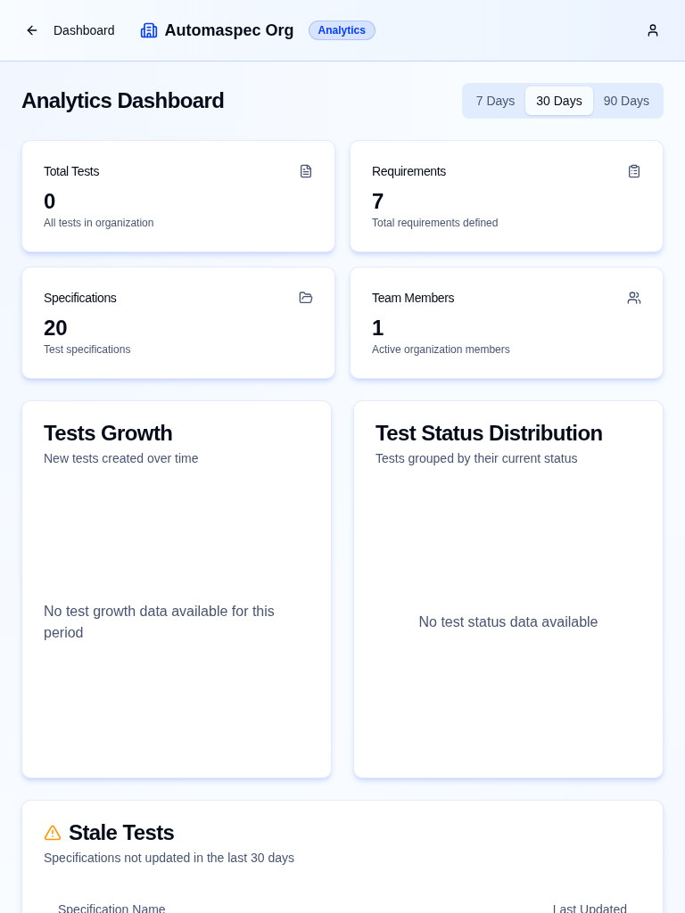

Adaptive UI Documentation

## Overview

AutomaSpec provides a responsive UI that keeps the core product flows usable and visually consistent across mobile, tablet, and desktop.

## Device Support

- Mobile (~375px-767px): single-column layouts and touch-friendly controls
- Tablet (~768px-1023px): increased density, two-column layouts where appropriate
- Desktop (1024px+): full layouts with side navigation and multi-panel pages

Tailwind breakpoints used throughout the UI:

- 640px (sm), 768px (md), 1024px (lg), 1280px (xl), 1536px (2xl)

## Visual and Accessibility Criteria

- Typography scales via relative sizing and responsive utilities
- Icons are SVG-based (Lucide) and scale without distortion
- Interactive controls keep mobile-friendly hit targets
- Light/dark theme support via `next-themes` with CSS variables

## Layout and Components

- Layout composition via Tailwind CSS v4 responsive utilities (`sm:`, `md:`, `lg:`)
- Sheet/drawer patterns for mobile navigation and actions
- Reusable UI primitives live in `components/ui`

## Screenshots (Production)

### Home

#### Desktop

#### Tablet

#### Mobile

### Login

#### Desktop

#### Tablet

#### Mobile

### Choose Organization

#### Desktop

#### Tablet

#### Mobile

### Dashboard

#### Desktop

#### Tablet

#### Mobile

### Folder View

#### Desktop

#### Tablet

#### Mobile

### Analytics

#### Desktop

#### Tablet

#### Mobile

### RPC Docs

#### Desktop

#### Tablet

#### Mobile

## Technical Notes

- Framework: Next.js 16 (App Router) + React 19 + TypeScript
- Styling: Tailwind CSS v4
- Theme: `next-themes` + CSS variables
- Icons: `lucide-react`

## Conclusion

The UI adapts to common device breakpoints and maintains functional parity across screen sizes for key product flows.