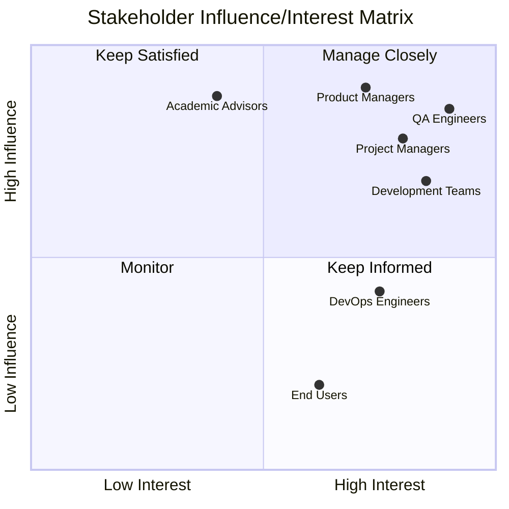
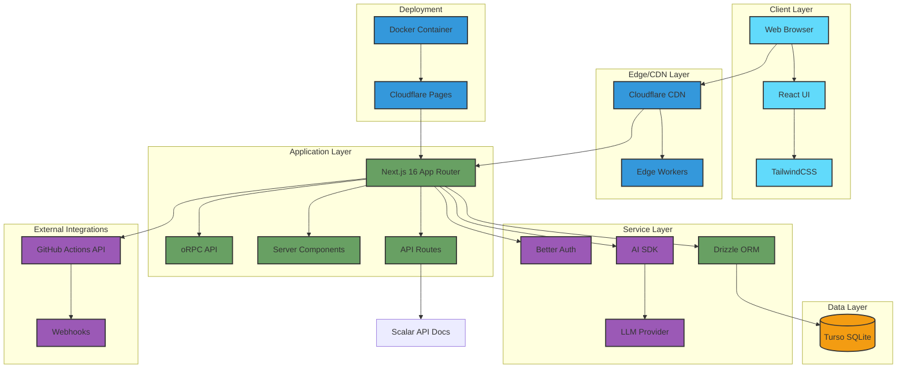

# Business Analysis Requirements Document
## Automaspec: AI-Powered Test Specification and Automation Platform

---

## 1. Introduction

### 1.1 Purpose of the Document

This Business Analysis Requirements Document serves as a comprehensive specification for the Automaspec project, developed as part of diploma preparation. The document provides a structured overview of the business problem, proposed solution, functional and non-functional requirements, and implementation considerations.

The primary objectives of this document are to:
- Define clear project boundaries and scope
- Establish measurable success criteria and business objectives
- Document functional requirements through user stories and use cases
- Identify technical architecture and integration points
- Assess risks, dependencies, and mitigation strategies
- Provide a foundation for project evaluation and stakeholder alignment

### 1.2 Audience

This document is intended for:
- **Academic reviewers and professors** evaluating the diploma project
- **Project stakeholders** including development team members
- **Technical evaluators** assessing architecture and design decisions
- **Future maintainers** requiring comprehensive project understanding

---

## 2. Vision

### 2.1 Vision Statement

Automaspec is an AI-powered test specification and automation platform that revolutionizes how development teams manage, document, and generate test cases. By combining intelligent test generation with collaborative specification management, Automaspec empowers QA engineers and developers to create comprehensive test coverage faster while maintaining centralized documentation and real-time synchronization with CI/CD pipelines.

### 2.2 Problem Statement

Modern software development teams face significant challenges in test management and documentation:

**Current Problems:**
1. **Scattered Documentation**: Test specifications are fragmented across multiple tools (Jira, Confluence, Excel, code comments), making it difficult to maintain a single source of truth
2. **Manual Test Creation**: Writing test code is time-consuming and repetitive, requiring developers and QA engineers to spend significant effort on boilerplate code
3. **Lack of Structure**: No standardized hierarchy for organizing test specifications leads to inconsistent documentation practices
4. **Poor Visibility**: Limited real-time visibility into test coverage and status across projects
5. **No AI Assistance**: Existing tools lack intelligent automation for test generation, forcing teams to write every test manually
6. **Integration Gaps**: Disconnect between test documentation and CI/CD execution results

**Business Impact:**
- Increased time-to-market due to slow test creation
- Higher maintenance costs from scattered documentation
- Reduced test coverage leading to quality issues
- Team inefficiency from manual, repetitive work

### 2.3 Business Goals & Objectives

**Primary Objectives:**
1. **Centralize Test Documentation**: Provide a single platform for all test specifications with hierarchical organization
2. **Accelerate Test Creation**: Reduce test creation time by 20-30% using AI-powered code generation
3. **Improve Test Coverage Tracking**: Increase visibility into test coverage by 40% through automated status tracking and reporting
4. **Enable Team Collaboration**: Facilitate real-time collaboration between QA engineers and developers
5. **Automate CI/CD Integration**: Seamlessly sync test results from GitHub Actions to maintain up-to-date status

**Secondary Objectives:**
- Establish standardized test documentation practices
- Reduce technical debt in testing infrastructure
- Improve team productivity and satisfaction
- Create foundation for future multi-framework support

### 2.4 Stakeholders Analysis



**Stakeholder Descriptions:**

| Stakeholder | Role | Interest | Influence | Engagement Strategy |
|-------------|------|----------|-----------|---------------------|
| **QA Engineers** | Primary Users | High | High | Direct involvement in requirements, beta testing, feedback sessions |
| **Development Teams** | Primary Users | High | High | Co-design features, continuous feedback, adoption champions |
| **Product Managers** | Decision Makers | Medium-High | High | Regular updates, demo sessions, ROI metrics |
| **Project Managers** | Oversight | High | Medium-High | Status reports, risk management involvement |
| **Academic Advisors** | Evaluators | Medium | High | Documentation, milestone presentations, quality assurance |
| **DevOps Engineers** | Integration Support | Medium | Medium | Technical consultation for CI/CD integration |
| **End Users (Team Members)** | Indirect Users | Medium | Low | Training materials, user documentation |

### 2.5 Success Criteria

**Measurable KPIs:**

1. **Test Creation Efficiency**
   - Target: 20-30% reduction in average time to create test code
   - Measurement: Time from requirement definition to completed test code
   - Baseline: Manual test creation time (pre-AI)

2. **Platform Adoption**
   - Target: 80% of invited users actively using platform within 2 months
   - Measurement: Monthly active users / Total registered users
   - Success threshold: >=5 organizations onboarded for beta

3. **Test Coverage Improvement**
   - Target: 40% improvement in test coverage visibility
   - Measurement: Percentage of specs with tracked status vs. undocumented
   - Success threshold: 90% of test specs have associated status tracking

4. **User Satisfaction**
   - Target: Net Promoter Score (NPS) >= 40
   - Measurement: User survey responses
   - Success threshold: >=70% users rate experience as "Good" or "Excellent"

5. **System Performance**
   - Target: Page load time < 2 seconds, AI generation < 60 seconds
   - Measurement: Performance monitoring metrics
   - Success threshold: 95th percentile within targets

6. **CI/CD Integration Success**
   - Target: Automated test result sync in >=80% of connected repositories
   - Measurement: Successful sync events / Total test runs
   - Success threshold: Zero data loss, < 5-minute sync delay

---

## 3. Scope

### 3.1 In-Scope

**Core Functionality:**
1. **Test Specification Management**
   - Hierarchical organization (Folders → Specs → Requirements → Tests)
   - CRUD operations for all entities
   - Drag-and-drop reordering
   - Rich text descriptions and documentation

2. **AI-Powered Test Code Generation**
   - Vitest framework support
   - AI SDK integration for intelligent code generation
   - Context-aware test generation based on requirements
   - Code review and editing capabilities

3. **Multi-Organization Support**
   - Organization creation and management
   - Role-based access control (Owner, Admin, Member)
   - Team invitation system
   - Organization-level isolation

4. **Test Status Tracking and Reporting**
   - Real-time status updates (passed, failed, pending, skipped, etc.)
   - Aggregated status at spec level
   - Visual status indicators
   - Basic reporting dashboards

5. **Authentication and User Management**
   - Email/password authentication via Better Auth
   - User profile management
   - Session management
   - Secure password handling

6. **CI/CD Integration (GitHub Actions)**
   - GitHub Actions API integration
   - Automated test result synchronization
   - Test status updates from CI/CD runs
   - Webhook support for real-time updates

7. **Docker Containerization**
   - Dockerfile for application deployment
   - Docker Compose for local development
   - Container optimization for cloud deployment

### 3.2 Out-of-Scope

**Explicitly Excluded from Current Phase:**
1. **Test Execution Engine**
   - Automaspec manages specifications and code, but does not run tests
   - Test execution handled by external test runners (Vitest, CI/CD)

2. **Mobile Applications**
   - No native iOS or Android applications
   - Responsive web design for mobile browsers only

3. **Multi-Framework Support** (Future Phase)
   - Current version supports Vitest only
   - Jest, Playwright, Cypress support planned for future releases

4. **Jira Integration** (Future Phase)
   - Integration with Jira for issue tracking
   - Bidirectional sync with Jira test management
   - Planned as post-MVP feature

5. **Advanced Analytics and Reporting** (Future Phase)
   - Custom report builders
   - Trend analysis and historical data
   - Predictive quality metrics

### 3.3 Assumptions

The project is built on the following key assumptions:

1. **User Competency**
   - Users have basic knowledge of software testing concepts
   - Users are familiar with Vitest testing framework
   - Users understand version control and CI/CD basics

2. **Technical Environment**
   - Organizations use Vitest for their testing needs
   - Users have access to modern web browsers (Chrome, Firefox, Safari, Edge)
   - GitHub Actions is available and accessible for CI/CD integration
   - Stable internet connection for cloud-based platform access

3. **AI Service Availability**
   - AI SDK and underlying LLM APIs remain available and stable
   - API rate limits are sufficient for expected usage
   - AI-generated code quality meets minimum standards

4. **Data and Security**
   - Users consent to storing test specifications in cloud database
   - Organizations accept shared hosting environment (multi-tenancy)
   - GDPR compliance measures are sufficient for target markets

### 3.4 Constraints

**Technical Constraints:**
1. **Hosting Platform Limitations**
   - Cloudflare free tier bandwidth and compute limits
   - Turso database storage and read/write quotas
   - Potential cold start delays on free hosting

2. **Team Resources**
   - Two-developer team limits development velocity
   - Limited time for extensive feature development
   - No dedicated designer or UX specialist

3. **Database Technology**
   - Turso (SQLite) as primary database for MVP
   - SQLite limitations on concurrent writes
   - Limited advanced database features compared to PostgreSQL

4. **Framework Lock-in**
   - Initial version limited to Vitest framework
   - AI code generation templates specific to Vitest
   - Migration to multi-framework support requires significant refactoring

**Business Constraints:**
1. **Budget Limitations**
   - Free/low-cost services preferred (Cloudflare, Turso, Better Auth)
   - AI API costs must remain within reasonable limits
   - No budget for premium tools or services

2. **Timeline Pressure**
   - Diploma submission deadline drives development schedule
   - Must prioritize Must Have features
   - Limited time for user testing and iteration

3. **Compliance Requirements**
   - Must comply with GDPR for user data
   - Academic integrity requirements for diploma project
   - Open-source licensing considerations

---

## 4. High-Level Solution Overview

### 4.1 Proposed Solution

Automaspec is a **web-based SaaS platform** built on modern technologies that addresses the test documentation and generation challenges through:

**Key Solution Components:**

1. **Intelligent Test Generation Engine**
   - Leverages AI SDK to generate Vitest test code from natural language requirements
   - Context-aware generation considering folder structure and existing tests
   - Editable output allowing developers to refine AI suggestions

2. **Hierarchical Organization System**
   - Four-level hierarchy: Folders → Test Specs → Requirements → Tests
   - Drag-and-drop interface for intuitive organization
   - Unlimited nesting of folders for complex project structures

3. **Real-Time Collaboration Platform**
   - Multi-user support within organizations
   - Role-based permissions (Owner, Admin, Member)
   - Real-time updates using modern web technologies

4. **Automated CI/CD Synchronization**
   - GitHub Actions integration for test result ingestion
   - Automatic status updates on test execution
   - Webhooks for real-time notification of CI/CD events

5. **Containerized Deployment**
   - Docker containerization for consistent deployment
   - Easy scaling and migration between hosting platforms
   - Simplified local development environment setup

**Technical Foundation:**
- **Frontend**: React with Next.js 16 (App Router), TailwindCSS for styling
- **Backend**: Next.js API routes with oRPC for type-safe RPC
- **Database**: Turso (distributed SQLite) with Drizzle ORM
- **AI**: AI SDK for LLM integration
- **Authentication**: Better Auth for secure user management
- **Hosting**: Cloudflare for global edge deployment
- **CI/CD**: GitHub Actions for automated workflows
- **Documentation**: Scalar for API documentation

### 4.2 Architecture / Integration Landscape



**Architecture Description:**

**Client Layer:**
- Modern React-based UI with Next.js 16 framework
- TailwindCSS for responsive, utility-first styling
- Type-safe communication with backend via oRPC

**Edge/CDN Layer:**
- Cloudflare CDN for global content distribution
- Edge Workers for optimized routing and caching
- SSL/TLS termination and DDoS protection

**Application Layer:**
- Next.js 16 with App Router for server-side rendering and routing
- oRPC for type-safe, validated API endpoints
- Server Components for optimal performance
- API Routes for external integrations and webhooks

**Service Layer:**
- Better Auth: Secure authentication and session management
- AI SDK: Unified interface for LLM providers (OpenAI, Anthropic)
- Drizzle ORM: Type-safe database queries and migrations

**Data Layer:**
- Turso: Distributed SQLite database with global replication
- Automatic backups and point-in-time recovery

**External Integrations:**
- GitHub Actions API for test result synchronization
- Webhooks for real-time CI/CD event notifications

**Deployment:**
- Docker containers for consistent deployment
- Cloudflare Pages for hosting and continuous deployment

### 4.3 Alternatives Considered

**Alternative 1: Standalone Desktop Application**
- **Description**: Electron-based desktop app with local storage
- **Pros**: Offline capability, no hosting costs, faster performance
- **Cons**: Limited collaboration, manual synchronization, no mobile access
- **Decision**: Rejected due to limited accessibility and collaboration needs

**Alternative 2: Immediate Jira Integration**
- **Description**: Built-in bidirectional sync with Jira from MVP
- **Pros**: Seamless workflow for teams already using Jira
- **Cons**: Significant complexity, vendor lock-in, extended development time
- **Decision**: Postponed to future phase to focus on core features

**Alternative 3: Google Sheets-Based Solution**
- **Description**: Google Sheets with Apps Script for automation
- **Pros**: Familiar interface, easy setup, built-in collaboration
- **Cons**: No structure enforcement, limited UI/UX, no AI capabilities
- **Decision**: Rejected due to lack of structure and AI integration

**Alternative 4: Traditional VPS Hosting (DigitalOcean, AWS EC2)**
- **Description**: Self-managed virtual private server
- **Pros**: Full control, predictable pricing, no vendor limitations
- **Cons**: Higher operational overhead, manual scaling, no edge network
- **Decision**: Rejected in favor of Cloudflare for superior performance, automatic scaling, and reduced management overhead

**Alternative 5: PostgreSQL Database**
- **Description**: Traditional PostgreSQL instead of Turso
- **Pros**: More features, better for complex queries, widely adopted
- **Cons**: Hosting costs, more complex setup, no edge distribution
- **Decision**: Rejected in favor of Turso for free tier benefits and edge distribution

---

## 5. Features & Requirements

### 5.1 Core Features (Epics)

| Epic ID | Epic Name | Priority | Description |
|---------|-----------|----------|-------------|
| Epic 1 | User Authentication & Organization Management | Must Have | User registration, login, organization creation, team invitations |
| Epic 2 | Test Specification Hierarchy | Must Have | Folder/spec/requirement/test management with hierarchical structure |
| Epic 3 | AI Test Generation | Must Have | AI-powered test code generation using AI SDK |
| Epic 4 | Test Status Tracking | Must Have | Real-time test status tracking and aggregation |
| Epic 5 | CI/CD Integration (GitHub Actions) | Must Have | Automated synchronization with GitHub Actions |
| Epic 6 | Collaboration & Team Management | Should Have | Role-based access control and team collaboration features |
| Epic 7 | Reporting & Analytics | Could Have | Test coverage reports and data export |

### 5.2 Functional Requirements - Work Breakdown

#### Epic 1: User Authentication & Organization Management (Must Have)

**US-1.1: User Registration**
- **As a** new user
- **I want to** sign up with email/password
- **So that** I can access the platform and create test specifications

 - **Acceptance Criteria:**
   - Users can register using a valid email and password.
   - Password meets complexity requirements (minimum 8 characters).
   - Successful registration creates a user record and returns a success response.
   - New users can log in immediately after registration or receive a confirmation flow if email verification is enabled.

**US-1.2: Organization Creation**
- **As a** registered user
- **I want to** create an organization
- **So that** I can manage my team's test specifications in an isolated workspace

 - **Acceptance Criteria:**
   - Registered users can create an organization with a unique name.
   - Creating an organization assigns the creator the Owner role.
   - Organization creation returns the organization ID and an initial empty workspace.

**US-1.3: Team Member Invitations**
- **As an** organization owner
- **I want to** invite team members via email
- **So that** they can collaborate on test specifications

 - **Acceptance Criteria:**
   - Owners can invite users by entering one or more email addresses.
   - Invitees receive an email with an invitation link and instructions.
   - Accepted invitations add the user to the organization with the specified role.
   - The system prevents duplicate invitations to existing org members.

**US-1.4: User Profile Management**
- **As a** registered user
- **I want to** update my profile information
- **So that** my account details remain current

 - **Acceptance Criteria:**
   - Users can view and edit their profile fields (name, display name, avatar, etc.).
   - Profile updates persist and are reflected across the application immediately.
   - Validation prevents invalid profile data (e.g., malformed email).

---

#### Epic 2: Test Specification Hierarchy (Must Have)

**US-2.1: Folder Creation and Organization**
- **As a** QA engineer
- **I want to** create folders with nested structure
- **So that** I can organize test specs by feature/module/component

 - **Acceptance Criteria:**
   - Users can create folders at the root and inside other folders (nesting).
   - Folder names are editable and unique within the same parent.
   - Folders can be collapsed/expanded in the UI and persist across sessions.

**US-2.2: Test Spec Creation**
- **As a** developer
- **I want to** create test specifications with name and description
- **So that** I can document test scenarios for specific features

 - **Acceptance Criteria:**
   - Users can create a test spec with a name and optional description.
   - New specs appear in the selected folder and are immediately editable.
   - Spec creation validates required fields and returns the new spec ID.

**US-2.3: Requirement Definition**
- **As a** QA engineer
- **I want to** add requirements to test specs
- **So that** I can break down test coverage into granular testable units

 - **Acceptance Criteria:**
   - Users can add, edit, and delete requirements inside a test spec.
   - Requirements support rich text or markdown (as configured).
   - Each requirement can be linked to one or more tests and saved successfully.

**US-2.4: Item Reordering**
- **As a** developer
- **I want to** reorder folders, specs, and requirements via drag-and-drop
- **So that** I can maintain logical structure that matches project organization

 - **Acceptance Criteria:**
   - Drag-and-drop reordering updates the order in the UI and persists to the backend.
   - Reordering preserves parent/child relationships and updates indexes consistently.
   - Concurrent reorder attempts are handled gracefully with last-write-wins or optimistic locking.

**US-2.5: Bulk Operations**
- **As a** QA engineer
- **I want to** move or copy multiple specs between folders
- **So that** I can efficiently reorganize test documentation

 - **Acceptance Criteria:**
   - Users can select multiple specs and perform move or copy operations.
   - Bulk operations provide progress feedback and report failures per item.
   - Copied specs retain their content but receive new IDs in the destination.

---

#### Epic 3: AI Test Generation (Must Have)

**US-3.1: AI-Powered Code Generation**
- **As a** developer
- **I want to** generate Vitest test code from requirements using AI SDK
- **So that** I can save time on writing boilerplate test code

 - **Acceptance Criteria:**
   - Users can request AI generation for a requirement and receive a code suggestion within configured time limits.
   - Generated code is syntactically valid and follows Vitest conventions.
   - Users can preview, accept, or reject generated code; accepted code is saved to the spec/test.

**US-3.2: Code Review Interface**
- **As a** QA engineer
- **I want to** review AI-generated test code before saving
- **So that** I can ensure code quality and correctness

 - **Acceptance Criteria:**
   - The UI presents generated code with syntax highlighting and diff view against existing code.
   - Reviewers can add inline comments and request regeneration.
   - Only accepted code is persisted to the test record.

**US-3.3: Test Code Editing**
- **As a** developer
- **I want to** edit generated test code directly in the platform
- **So that** I can customize tests to match specific needs

 - **Acceptance Criteria:**
   - Users can edit test code in an editor with syntax highlighting and save changes.
   - The editor validates basic syntax and warns about obvious errors.
   - Saved edits update the associated test record and are versioned if applicable.

**US-3.4: Code Export**
- **As a** developer
- **I want to** export generated test code to files
- **So that** I can integrate tests into my codebase

 - **Acceptance Criteria:**
   - Users can export one or more tests/specs as files in a zip or repository-friendly structure.
   - Exported files contain all necessary metadata and are downloadable.
   - Export reports any conflicts or missing fields that prevent export.

---

#### Epic 4: Test Status Tracking (Must Have)

**US-4.1: Test Status Visualization**
- **As a** QA engineer
- **I want to** see test status (passed/failed/pending/skipped/missing)
- **So that** I can track test coverage and identify failing tests

 - **Acceptance Criteria:**
   - Test items display a clear status indicator reflecting the latest known state.
   - Status updates propagate to the UI within expected sync windows after CI events.
   - Missing or unlinked tests are flagged for review.

**US-4.2: Aggregated Status at Spec Level**
- **As a** developer
- **I want to** see aggregated status for entire test specs
- **So that** I can quickly identify problematic areas

 - **Acceptance Criteria:**
   - Spec-level aggregation shows counts of passed/failed/pending tests.
   - Aggregation updates when individual test statuses change.
   - Aggregated view supports filtering by status and time range.

**US-4.3: Status History**
- **As a** QA lead
- **I want to** view status change history for tests
- **So that** I can track test stability over time

 - **Acceptance Criteria:**
   - Users can view a timeline of status changes for a test or spec.
   - History entries include timestamp, source (CI or manual), and user if applicable.
   - History can be exported or filtered by date range.

---

#### Epic 5: CI/CD Integration (GitHub Actions) (Must Have)

**US-5.1: GitHub Actions Connection**
- **As a** developer
- **I want to** connect my GitHub repository to Automaspec
- **So that** test results automatically sync from CI/CD runs

 - **Acceptance Criteria:**
   - Users can authorize a GitHub repository and configure which workflows to ingest.
   - Successful connection shows repository metadata and last sync time.
   - Connection errors are surfaced with actionable messages.

**US-5.2: Automated Test Result Sync**
- **As a** developer
- **I want to** have test results from GitHub Actions automatically update spec status
- **So that** I don't need to manually track test execution results

 - **Acceptance Criteria:**
   - CI run results are parsed and mapped to tests/specs; statuses are updated automatically.
   - Syncs are idempotent and retry on transient failures.
   - Mapping failures are logged and surfaced for manual reconciliation.

**US-5.3: Test Spec Export for CI/CD**
- **As a** developer
- **I want to** export test specs in CI/CD-compatible format
- **So that** I can integrate generated tests into GitHub Actions workflows

 - **Acceptance Criteria:**
   - Exported specs include file layout and metadata required by CI workflows.
   - Export operation validates compatibility and reports issues.
   - Developers can download or push exported files to a configured repo.

**US-5.4: Failure Notifications**
- **As a** QA engineer
- **I want to** receive notifications when tests fail in CI/CD
- **So that** I can quickly respond to quality issues

 - **Acceptance Criteria:**
   - Notification channels (email, in-app) send alerts for failing runs based on user preferences.
   - Notifications include a link to the failed spec/test and CI logs.
   - Users can configure thresholds to reduce noise (e.g., only notify on repeated failures).

---

#### Epic 6: Collaboration & Team Management (Should Have)

**US-6.1: Role-Based Access Control**
- **As an** organization owner
- **I want to** assign roles (Owner, Admin, Member) to team members
- **So that** I can control who can modify test specifications

 - **Acceptance Criteria:**
   - Owners can assign and change roles for organization members.
   - Role changes take effect immediately and enforce UI/backend permissions.
   - Attempts to perform unauthorized actions return permission errors.

**US-6.2: Real-Time Updates**
- **As a** team member
- **I want to** see changes made by other users in real-time
- **So that** I can collaborate effectively without conflicts

 - **Acceptance Criteria:**
   - Real-time edits and structural changes appear to collaborators within expected latency.
   - The system handles edit conflicts with clear indicators and merge options.
   - Presence and change indicators show which user made recent edits.

**US-6.3: Activity Feed**
- **As an** organization admin
- **I want to** view activity log of changes to specs
- **So that** I can track team contributions and changes

 - **Acceptance Criteria:**
   - Activity feed records create/edit/delete actions with timestamp and actor.
   - Feed supports basic filtering (user, action type, date range).
   - Admins can export activity logs for audits.

---

#### Epic 7: Reporting & Analytics (Could Have)

**US-7.1: Test Coverage Reports**
- **As a** project manager
- **I want to** view test coverage reports and statistics
- **So that** I can assess quality and identify coverage gaps

 - **Acceptance Criteria:**
   - Reports summarize coverage metrics (e.g., percent of requirements with tests, pass rates).
   - Reports can be generated for a given time range and exported as PDF/CSV.
   - Report data aligns with latest synced CI results.

**US-7.2: Specification Export**
- **As a** QA lead
- **I want to** export test specifications to PDF/Excel
- **So that** I can share documentation with stakeholders

 - **Acceptance Criteria:**
   - Users can export selected specs or entire folders to PDF or Excel.
   - Exports include spec metadata, requirements, and linked tests.
   - Export process reports success/failure and provides downloadable artifacts.

**US-7.3: Dashboard Widgets**
- **As a** developer
- **I want to** customize dashboard with widgets showing key metrics
- **So that** I can monitor important KPIs at a glance

 - **Acceptance Criteria:**
   - Users can add, remove, and arrange dashboard widgets.
   - Widgets display live or near-real-time metrics and update on refresh intervals.
   - Widget configuration persists per user or organization settings.

---

### 5.3 Priority Labelling (MoSCoW Method)

**Must Have (Critical for MVP):**
- Epic 1: User Authentication & Organization Management
- Epic 2: Test Specification Hierarchy
- Epic 3: AI Test Generation
- Epic 4: Test Status Tracking
- Epic 5: CI/CD Integration (GitHub Actions)

**Should Have (Important but not critical):**
- Epic 6: Collaboration & Team Management
- Real-time updates and activity tracking
- Advanced role-based permissions

**Could Have (Desirable):**
- Epic 7: Reporting & Analytics
- Custom dashboard widgets
- Advanced export formats
- Historical trend analysis

**Won't Have (Future Phase):**
- Mobile native applications (iOS/Android)
- Multi-framework support (Jest, Playwright, Cypress)
- Jira integration
- Advanced AI features (test case optimization, intelligent suggestions)
- Custom theming and white-labeling

---

### 5.4 Non-Functional Requirements

**Performance Requirements:**
- **Page Load Time**: Initial page load < 2 seconds on 3G connection
- **AI Generation Time**: Test code generation < 60 seconds per requirement
- **API Response Time**: 95th percentile < 500ms for CRUD operations
- **Database Query Time**: 95th percentile < 100ms for standard queries
- **Concurrent Users**: Support 50 concurrent users per organization

**Security Requirements:**
- **Authentication**: Secure email/password authentication with bcrypt hashing
- **Authorization**: Role-based access control with organization-level isolation
- **Data Encryption**: HTTPS/TLS 1.3 for all data in transit
- **Password Policy**: Minimum 8 characters, complexity requirements
- **Session Management**: Secure session handling with automatic timeout
- **API Security**: Rate limiting to prevent abuse (100 requests/minute per user)
- **SQL Injection Protection**: Parameterized queries via Drizzle ORM
- **XSS Protection**: Input sanitization and output encoding

**Scalability Requirements:**
- **User Capacity**: Support 1,000 registered users in MVP phase
- **Organization Capacity**: Support 100 organizations
- **Data Storage**: Handle 10,000 test specifications per organization
- **Horizontal Scaling**: Docker containers allow horizontal scaling
- **Database Scaling**: Turso edge replication for read scalability

**Usability Requirements:**
- **Intuitive UI**: User can create first test spec within 5 minutes without documentation
- **Keyboard Shortcuts**: Common actions accessible via keyboard (Ctrl+N for new, etc.)
- **Responsive Design**: Full functionality on desktop, tablet, and mobile browsers
- **Accessibility**: WCAG 2.1 Level AA compliance for core features
- **Error Handling**: Clear, actionable error messages
- **Loading States**: Visual feedback for all async operations

**Availability Requirements:**
- **Uptime**: 99% uptime SLA on Cloudflare hosting
- **Recovery Time Objective (RTO)**: < 4 hours
- **Recovery Point Objective (RPO)**: < 24 hours (daily database backups)
- **Monitoring**: Real-time monitoring with alerting for downtime

**Maintainability Requirements:**
- **Code Quality**: TypeScript for type safety, ESLint for code standards
- **Documentation**: API documentation via Scalar, inline code comments
- **Automated Testing**: Unit test coverage >= 70%, integration tests for critical paths
- **Version Control**: Git with conventional commits
- **CI/CD Pipeline**: Automated builds, tests, and deployments
- **Database Migrations**: Versioned migrations via Drizzle Kit

**Portability Requirements:**
- **Containerization**: Docker support for deployment flexibility
- **Cross-Platform**: Runs on Linux, macOS, Windows via Docker
- **Browser Compatibility**: Support Chrome, Firefox, Safari, Edge (latest 2 versions)
- **Cloud Agnostic**: Can migrate between Cloudflare, Vercel, AWS, or self-hosted

**Compatibility Requirements:**
- **Vitest Integration**: Compatible with Vitest v1.x and v2.x
- **GitHub Actions**: Support GitHub Actions API v3
- **Modern Browsers**: ES2020 JavaScript features
- **Database**: SQLite 3.x compatible (Turso)

---

### 5.5 Regulatory / Compliance Needs

**GDPR Compliance (General Data Protection Regulation):**
- **Right to Access**: Users can download all their personal data
- **Right to Deletion**: Users can request complete account deletion
- **Right to Rectification**: Users can update personal information
- **Data Minimization**: Collect only necessary user data
- **Consent Management**: Clear consent for data collection and processing
- **Data Portability**: Export user data in machine-readable format (JSON)
- **Privacy Policy**: Clear privacy policy outlining data usage
- **Data Retention**: Define and enforce data retention policies
- **Breach Notification**: Process for notifying users of data breaches

**Academic Integrity:**
- **Original Work**: All code and documentation are original work for diploma project
- **Attribution**: Proper attribution for third-party libraries and frameworks
- **Code Repository**: Public GitHub repository demonstrating development history
- **Documentation**: Comprehensive documentation of design decisions

**Open Source Licensing:**
- **License Selection**: MIT or Apache 2.0 license for core application
- **Dependency Licensing**: Verify compatibility of all dependencies
- **Attribution**: Maintain NOTICE file with third-party attributions

**Data Residency:**
- **Turso Regions**: Data stored in Turso's closest edge location
- **User Control**: Users can request specific region preferences (future)

---

### 5.6 Use Case Diagram

```mermaid
graph TB
    subgraph Actors
        QA[QA Engineer]
        DEV[Developer]
        OWNER[Org Owner]
        MEMBER[Team Member]
        AI[AI SDK System]
        CICD[GitHub Actions]
    end
    
    subgraph Authentication
        UC1[Sign Up]
        UC2[Sign In]
        UC3[Manage Profile]
    end
    
    subgraph Organization Management
        UC4[Create Organization]
        UC5[Invite Members]
        UC6[Manage Roles]
    end
    
    subgraph Specification Management
        UC7[Create Folder]
        UC8[Create Test Spec]
        UC9[Add Requirements]
        UC10[Reorder Items]
    end
    
    subgraph AI Test Generation
        UC11[Generate Test Code]
        UC12[Review Generated Code]
        UC13[Edit Test Code]
        UC14[Export Tests]
    end
    
    subgraph Status Tracking
        UC15[View Test Status]
        UC16[Track Spec Status]
    end
    
    subgraph CI/CD Integration
        UC17[Connect GitHub Repo]
        UC18[Sync Test Results]
        UC19[Send Failure Alerts]
    end
    
    subgraph Collaboration
        UC20[View Team Activity]
        UC21[Real-time Updates]
    end
    
    subgraph Reporting
        UC22[Generate Reports]
        UC23[Export Documentation]
    end
    
    QA --> UC1
    DEV --> UC1
    QA --> UC2
    DEV --> UC2
    QA --> UC3
    DEV --> UC3
    
    OWNER --> UC4
    OWNER --> UC5
    OWNER --> UC6
    
    QA --> UC7
    DEV --> UC8
    QA --> UC9
    DEV --> UC10
    
    DEV --> UC11
    QA --> UC12
    DEV --> UC13
    DEV --> UC14
    AI -.-> UC11
    
    QA --> UC15
    DEV --> UC16
    
    DEV --> UC17
    CICD -.-> UC18
    UC18 --> UC19
    
    MEMBER --> UC20
    MEMBER --> UC21
    
    OWNER --> UC22
    QA --> UC23
    
    classDef actor fill:#e74c3c,stroke:#c0392b,stroke-width:2px,color:#fff
    classDef usecase fill:#3498db,stroke:#2980b9,stroke-width:2px,color:#fff
    classDef system fill:#95a5a6,stroke:#7f8c8d,stroke-width:2px,color:#fff
    
    class QA,DEV,OWNER,MEMBER actor
    class AI,CICD system
    class UC1,UC2,UC3,UC4,UC5,UC6,UC7,UC8,UC9,UC10,UC11,UC12,UC13,UC14,UC15,UC16,UC17,UC18,UC19,UC20,UC21,UC22,UC23 usecase
```



**Use Case Descriptions:**

| Use Case | Actor(s) | Description |
|----------|----------|-------------|
| UC1: Sign Up | QA Engineer, Developer | Register new user account with email/password |
| UC2: Sign In | QA Engineer, Developer | Authenticate and access platform |
| UC3: Manage Profile | QA Engineer, Developer | Update user profile information |
| UC4: Create Organization | Org Owner | Create new organization workspace |
| UC5: Invite Members | Org Owner | Invite team members to organization |
| UC6: Manage Roles | Org Owner | Assign roles and permissions to members |
| UC7: Create Folder | QA Engineer | Create folder for organizing test specs |
| UC8: Create Test Spec | Developer | Create new test specification document |
| UC9: Add Requirements | QA Engineer | Define testable requirements within spec |
| UC10: Reorder Items | Developer | Reorganize folder/spec hierarchy |
| UC11: Generate Test Code | Developer, AI SDK | Generate Vitest code from requirements |
| UC12: Review Generated Code | QA Engineer | Review and validate AI-generated tests |
| UC13: Edit Test Code | Developer | Modify generated test code |
| UC14: Export Tests | Developer | Export test code to files |
| UC15: View Test Status | QA Engineer | Monitor test execution status |
| UC16: Track Spec Status | Developer | View aggregated status for specs |
| UC17: Connect GitHub Repo | Developer | Link GitHub repository for CI/CD sync |
| UC18: Sync Test Results | GitHub Actions | Automatically sync test execution results |
| UC19: Send Failure Alerts | System | Notify team of test failures |
| UC20: View Team Activity | Team Member | Monitor team changes and updates |
| UC21: Real-time Updates | Team Member | Receive live updates from collaborators |
| UC22: Generate Reports | Org Owner | Create test coverage reports |
| UC23: Export Documentation | QA Engineer | Export specs to shareable formats |

---

## 6. Risks & Dependencies

### 6.1 Risks

| Risk ID | Risk Description | Likelihood | Impact | Severity | Owner |
|---------|------------------|------------|--------|----------|-------|
| R1 | AI SDK API costs exceed budget due to high usage | Medium | High | High | Development Team |
| R2 | Limited real user testing leads to usability issues | High | Medium | Medium | Development Team |
| R3 | GitHub Actions integration complexity causes delays | Medium | Medium | Medium | Development Team |
| R4 | Cloudflare/Turso free tier limitations impact performance | Low | Low | Low | Development Team |
| R5 | AI-generated test quality is insufficient | Medium | High | High | Development Team |
| R6 | Better Auth service outage disrupts authentication | Low | High | Medium | Third-party Service |
| R7 | SQLite limitations cause performance bottlenecks | Low | Medium | Low | Development Team |
| R8 | Scope creep delays MVP delivery | Medium | High | High | Project Management |

**Risk Matrix:**

```
         Impact
        Low    Medium    High
High    R4      R2       R1, R5, R8
Medium  R7      R3, R6    -
Low      -       -        -
    Likelihood
```

### 6.2 Dependencies

**Critical Dependencies:**

1. **AI SDK and LLM API Availability**
   - **Type**: External Service
   - **Criticality**: High
   - **Description**: Platform relies on AI SDK for core test generation feature
   - **Contingency**: Implement fallback to manual test creation if AI unavailable

2. **Cloudflare Hosting Platform**
   - **Type**: Infrastructure
   - **Criticality**: High
   - **Description**: Application hosting and CDN services
   - **Contingency**: Docker containerization allows migration to alternative hosting

3. **Turso Database Service**
   - **Type**: Infrastructure
   - **Criticality**: High
   - **Description**: Primary data storage for all test specifications
   - **Contingency**: Regular backups, ability to migrate to self-hosted SQLite

4. **Better Auth Service**
   - **Type**: External Service
   - **Criticality**: High
   - **Description**: User authentication and session management
   - **Contingency**: Implement fallback to basic auth if service unavailable

5. **GitHub Actions API**
   - **Type**: External Integration
   - **Criticality**: Medium
   - **Description**: CI/CD test result synchronization
   - **Contingency**: Manual test result upload feature

**Supporting Dependencies:**

6. **Modern Browser Support**
   - **Type**: Client Requirement
   - **Criticality**: Medium
   - **Description**: Platform requires modern browsers with ES2020 support
   - **Contingency**: Progressive enhancement for older browsers

7. **Node.js Ecosystem**
   - **Type**: Development Dependency
   - **Criticality**: Medium
   - **Description**: Next.js, React, and build tools require Node.js
   - **Contingency**: Stable Node.js LTS version

8. **Vercel AI SDK Library**
   - **Type**: Software Dependency
   - **Criticality**: High
   - **Description**: Abstraction layer for LLM providers
   - **Contingency**: Direct API integration if SDK unavailable

### 6.3 Mitigation Strategies

**Risk R1: AI SDK API Costs May Exceed Budget**
- **Prevention**:
  - Implement strict API request quotas per user/organization
  - Cache AI-generated code to avoid regeneration
  - Provide usage dashboard for cost monitoring
  - Set hard limits on generation requests per day
- **Response**:
  - Implement tier-based pricing if costs escalate
  - Switch to more cost-effective LLM providers
  - Reduce AI context size to minimize token usage

**Risk R2: Limited Testing with Real Users**
- **Prevention**:
  - Conduct early beta testing with 5-10 users from target audience
  - Create detailed test scenarios covering common workflows
  - Implement analytics to track user behavior
- **Response**:
  - Rapid iteration based on feedback
  - Prioritize critical usability issues
  - Post-MVP user testing for continuous improvement

**Risk R3: GitHub Actions Integration Complexity**
- **Prevention**:
  - Start with basic integration, iterate gradually
  - Use well-documented GitHub Actions APIs
  - Implement comprehensive error handling
  - Test with multiple repository types
- **Response**:
  - Simplify integration scope if complexity exceeds estimates
  - Provide detailed integration documentation
  - Offer manual result upload as fallback

**Risk R4: Cloudflare/Turso Free Tier Limitations**
- **Prevention**:
  - Implement aggressive caching strategies
  - Optimize database queries and indexes
  - Monitor usage metrics proactively
  - Implement request throttling
- **Response**:
  - Upgrade to paid tier if necessary
  - Migrate to alternative hosting (Docker enables this)
  - Implement usage-based access controls

**Risk R5: AI-Generated Test Quality is Insufficient**
- **Prevention**:
  - Implement AI prompt engineering best practices
  - Provide rich context to AI (folder structure, existing tests)
  - Add code review step before accepting generated code
  - Iterate on prompts based on output quality
- **Response**:
  - Allow manual editing of all generated code
  - Provide templates and examples for better generation
  - Collect feedback on generation quality

**Risk R6: Better Auth Service Outage**
- **Prevention**:
  - Monitor Better Auth status page proactively
  - Implement graceful degradation for auth features
  - Cache authentication tokens appropriately
- **Response**:
  - Implement basic email/password auth as fallback
  - Communicate outage to users transparently
  - Consider self-hosted auth solution for critical situations

**Risk R7: SQLite Limitations Cause Performance Bottlenecks**
- **Prevention**:
  - Optimize queries with proper indexes
  - Implement read replicas via Turso edge network
  - Use connection pooling
  - Profile slow queries regularly
- **Response**:
  - Implement caching layer for frequently accessed data
  - Consider migration to PostgreSQL if bottlenecks persist
  - Optimize data model and normalization

**Risk R8: Scope Creep Delays MVP Delivery**
- **Prevention**:
  - Strict adherence to MoSCoW prioritization
  - Weekly sprint reviews with scope validation
  - Maintain feature freeze 2 weeks before deadline
  - Say "no" to non-essential features
- **Response**:
  - Cut Could Have features immediately if timeline at risk
  - Defer Should Have features to post-MVP
  - Focus exclusively on Must Have epics

---

## 7. Appendix

### 7.1 Glossary

| Term | Definition |
|------|------------|
| **AI SDK** | Unified SDK for interacting with multiple LLM providers |
| **Better Auth** | Open-source authentication solution |
| **CI/CD** | Continuous Integration/Continuous Deployment |
| **Cloudflare** | Global CDN and edge computing platform |
| **Drizzle ORM** | TypeScript ORM for SQL databases |
| **Epic** | Large body of work that can be broken down into user stories |
| **GitHub Actions** | CI/CD platform integrated with GitHub |
| **LLM** | Large Language Model (e.g., GPT-4, Claude) |
| **MoSCoW** | Prioritization method: Must Have, Should Have, Could Have, Won't Have |
| **MVP** | Minimum Viable Product |
| **Next.js** | React framework for production applications |
| **oRPC** | Type-safe RPC framework |
| **Scalar** | API documentation tool |
| **Test Spec** | Test specification document containing requirements and tests |
| **Turso** | Distributed SQLite database platform |
| **Vitest** | Fast unit testing framework for Vite projects |

### 7.2 References

1. **Business Analysis Body of Knowledge (BABOK)**
   - International Institute of Business Analysis (IIBA)
   - Requirements elicitation and documentation standards

2. **Technical Documentation**
   - Next.js Documentation: https://nextjs.org/docs
   - Turso Documentation: https://docs.turso.tech
   - AI SDK Documentation: https://sdk.vercel.ai
   - GitHub Actions API: https://docs.github.com/en/rest/actions

3. **Industry Standards**
   - ISO/IEC 25010: Systems and software quality models
   - IEEE 830: Software Requirements Specifications
   - WCAG 2.1: Web Content Accessibility Guidelines

4. **Regulatory Compliance**
   - GDPR (EU Regulation 2016/679): General Data Protection Regulation

### 7.3 Document Control

| Version | Date | Author | Changes |
|---------|------|--------|---------|
| 1.0 | 2025-10-15 | Development Team | Initial document creation |

---

**Document Prepared By:**  
Automaspec Development Team

**Prepared For:**  
Academic Review Committee

**Date:**  
October 15, 2025

**Status:**  
Final for Review

---

*This document represents the comprehensive business analysis for the Automaspec project, fulfilling the maximum requirements for diploma preparation. All sections adhere to industry-standard BA practices and academic requirements.*

